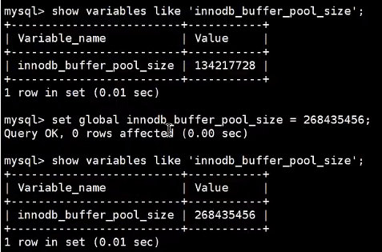
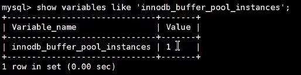
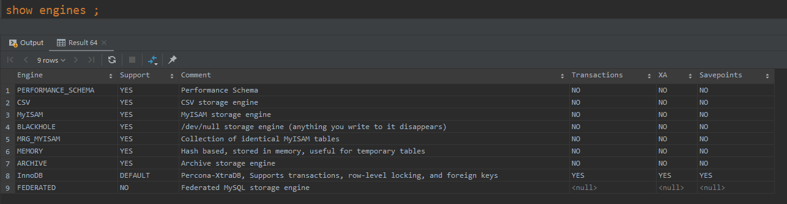
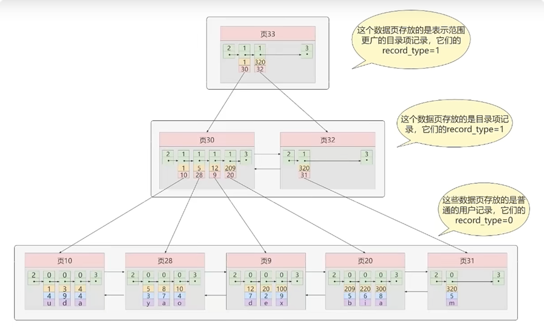
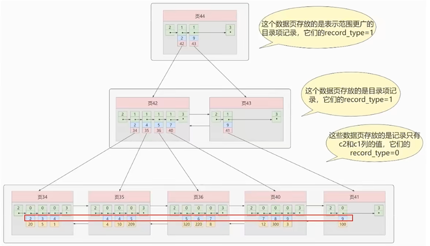
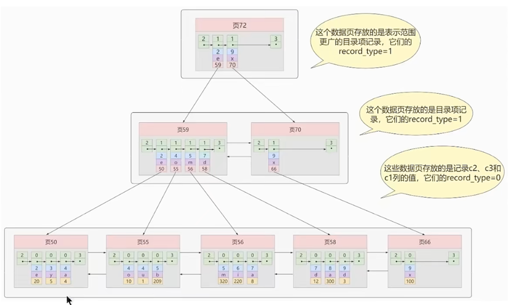
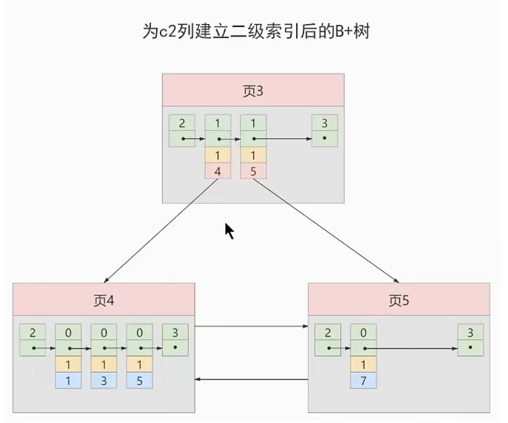
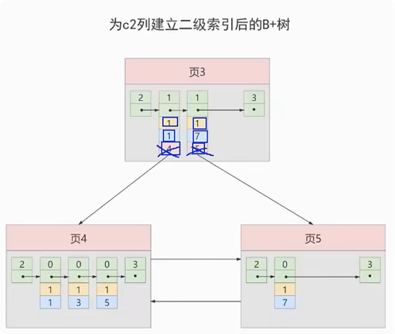

### item01: SQL执行流程
    1. 客户端 向 服务端 发起请求
    
    2. 服务端查询缓存，若缓存命中，则直接返回，否则进行步骤3 (缓存开关未开启也不会有查询缓存的过程，MySQL8.0不再有这个缓存)
    
    3. 词法解析，语法解析，预处理器进行预处理
    
    4. 查询优化器进行优化
    
    5. 生成执行计划，交于存储引擎进行查询
    
    6. 缓存结果，返回结果
    
### item02: MySQL的profiling
```sql
-- 通过开启profiling来了解查询语句的执行过程及耗时
-- select @@profiling; 或者 show variables like '%profiling%'; 查看是否开启计划，开启它可以让mysql收集在sql执行时所使用的资源情况
mysql> select @@profiling;
mysql> show variables like '%profiling%';

-- 临时开启profiling
mysql> set profiling = 1;

-- 使用show profiles;查看语句的执行过程及耗时
mysql> show profiles;
```

### item03: MySQL缓存的开启
```sql
-- 查看缓存开关
mysql> show variables like 'query_cache_type';

-- 开启缓存(临时) 或者 配置文件新增：query_cache_type=1
mysql> set query_cache_type = 1;
```

### item04: InnoDB缓冲池大小设置


### item05: 默认innodb缓冲池的个数


### item06: 查看mysql提供的存储引擎


### item07: InnoDB和MyISAM的区别
    1. MyISAM不支持外键，InnoDB支持外键
    
    2. MyISAM不支持事务，InnoDB支持事务
    
    3. MyISAM是表级锁，即使操作一条记录也会锁住整张表，不适合高并发的操作
       InnoDB是行级锁，操作时只锁某一行，不对其他行有影响，适合高并发的操作
    
    4. MyISAM关注点是性能，节省资源，消耗少，简单业务  InnoDB关注事务，并发写，事务，更大资源

### item08: 聚簇索引
    聚簇索引并不是一种单独的索引类型，而是一种数据存储方式（所有的数据记录都存储在了叶子节点），也就是所谓的索引即数据，数据即索引。
    
    术语"聚簇"表示数据行和相邻的键值聚簇的存储在一起
    
    特点：
        1. 使用记录主键值的大小进行记录和页的排序，这包括三个方面的含义：
            - 页内的记录是按照主键的大小顺序排成一个单向链表。
            - 各个存放用户记录的页也是根据页中用户记录的主键大小顺序的排成一个双向链表。
            - 存放目录项记录的页分为不同的层次，在同一层次中的页也是根据页中目录项记录的主键大小顺序的排成一个双向链表。
        2. B+树的叶子节点存储的是完整的用户记录。
            - 所谓完整的用户记录，就是指这个记录中存储了所有列的值（包括隐藏列）。
            
    我们把具有这两种特性的B+树称为聚簇索引，所有完整的用户记录都存放在这个聚簇索引的叶子节点处。
    这种聚簇索引并不需要我们在mysql语句中显示的使用index语句去创建，InnoDB存储引擎会自动的为我们创建聚簇索引。

    优点：
        - 数据访问更快，因为聚簇索引将索引和数据保存在同一个B+树中，因此从聚簇索引中获取数据比非聚簇索引更快。
        - 聚簇索引对于主键的排序查找和范围查找速度非常快。
        - 按照聚簇索引索引的排列顺序，查询显示一定范围数据的时候，由于数据都是紧密相连，数据库不用从多个数据块中提取数据，所以节省了大量的io操作。

    缺点：
        - 插入速度严重依赖插入顺序，按照主键的顺序插入是最快的方式，否则将会出现页分裂，严重影响性能。
          因此，对于InnoDB表，我们一般都会定义一个自增的ID列为主键
        - 更新主键的代价很高，因为将会导致被更新的行移动。因此，对于InnoDB表，我们一般定义主键为不可更新。
        - 二级索引访问需要两次索引查找，第一次找到主键值，第二次根据主键值找到行数据。

    限制：
        - 对于mysql数据库目前只有InnoDB数据引擎支持聚簇索引，而MyISAM并不支持聚簇索引。
        - 由于数据物理存储排序方式只能有一种，所以每个mysql的表只能有一个聚簇索引，一般情况下就是该表的主键。
        - 如果没有定义主键，InnoDB会选择非空的唯一索引代替。如果没有这样的索引，InnoDB会隐士的定义一个主键来作为聚簇索引。
        - 为了充分利用聚簇索引的聚簇的特性，所以InnoDB表的主键列尽量选用有序的顺序id，而不建议用无序的id，比如：uuid，md5，hash，字符串列作为主键无法保证数据的顺序增长。

#### 聚簇索引示例图：


### item09: 二级索引（辅助索引，非聚簇索引）

```text
概念：回表
    我们根据这个以c2列大小排序的B+树只能确定我们要查找记录的主键值，所以如果我们想根据c2列的值查找到完整的用户记录的话，
    仍然需要到聚簇索引中再查一遍，这个过程称为回表。也就是根据c2列的值查询一条完整的用户记录需要使用到2棵B+树！
    
问题：为什么我们还要一次回表操作呢？直接把完整的用户记录放到叶子节点不行吗？
回答：
    如果把完整的用户记录放到叶子节点是可以不用回表，但是太占地方了，相当于每建立一棵B+树都需要把所有的用户记录再拷贝一遍，这就有点太浪费存储空间了。
    
因为这种按照非主键列建立的B+树需要一次回表操作才可以定位到完整的用户记录，所以这种B+树也被称为二级索引（英文名：secondary index），
或者辅助索引，由于我们使用的是c2列的大小作为B+树的排序规则，所以我们也称这个B+树是为c2列建立的索引。

非聚簇索引的存在不影响数据在聚簇索引中的组织，所以一张表可以有多个非聚簇索引。
```

### item10: 联合索引



### item11: InnoDB的B+树索引的注意事项
```text
1. 根页面位置万年不动
   - 每当为某个表创建一个B+树索引（聚簇索引不是人为创建的，默认就有）的时候，都会为这个索引创建一个根节点页面。
     最开始表中没有数据的时候，每个B+树索引对应的根节点中既没有用户记录，也没有目录项记录。
   - 随后向表中插入用户记录时，先把用户记录存储到这个根节点中。
   - 当根节点中的可用空间用完时继续插入记录，此时会将根节点中的所有记录复制到一个新分配的页，比如页a中，然后对这个新页进行页分裂的操作，
     得到另一个新页，比如页b。这时新插入的记录根据键值（也就是聚簇索引中的主键值，二级索引中对应的索引列的值）的大小就会被分配到页a或者页b中，而根节点便升级为存储目录项记录的页。
   
   这个过程特别注意的是：一个B+树索引的根节点自诞生之日起，便不会再移动。这样只要我们对某个表建立一个索引，那么它的根节点的页号便会被记录到某个地方，
   然后凡是InnoDB存储引擎需要用到这个索引的时候，都会从那个固定的地方取出根节点的页号，从而来访问这个索引。
   
   
2. 内节点中目录项记录的唯一性
   B+树索引的内节点中目录项记录的内容是索引项+页号的搭配，但是这个搭配对于二级索引来说有点不严谨，假设表中的数据如下：
   c1           c2         c3
   1            1          'u'
   3            1          'd'
   5            1          'y'
   7            1          'a'
   如果二级索引中目录项记录的内容只是索引列+页号的搭配的话，那么为c2列建立的索引后的B+树应该长这样：
```

```text
  如果我们想插入一行记录，其中c1，c2，c3的值分别是：9，1，'c'，那么在修改这个为c2列建立的二级索引对应的B+树时便碰到了个大问题：
  由于页3中存储的目录项记录是由c2列+页号的值构成的，页3中的两条目录项记录对应的c2列的值都是1，而我们新插入的这条记录的c2列的值也是1，
  那我们这条新插入的记录到底应该放到页4中，还是页5中？？？
  
  为了让新插入的记录能够找到自己在那个页里，我们需要保证在B+树的同一层内节点目录项记录除页号这个字段以外是唯一的，所以对于二级索引的内节点的目录项记录的内容实际上是由三个部分构成的：
  + 索引列的值
  + 主键值
  + 页号
  也就是我们把主键值也添加到二级索引内节点中的目录项记录了，这样就能保证B+树每一层节点中各条目录项记录除页号这个字段外是唯一的，
  所以我们为c2列建立二级索引后的示意图实际上应该是这样子的：
```

```text
  这样我们再插入记录（9，1，’c’）时，由于 页3中存储的目录项记录是由c2列 ＋ 主键 ＋ 页号的值构成的，可以先把新记录的c2列的值和页3中各目录项记录的c2列的值作比较，
  如果c2列的值相同的话，可以接着比较主键值，因为B+树同一层中不同目录项记录的C2列 ＋ 主键的值肯定是不一样的，所以最后肯定能定位唯一的一条目录项记录，在本例中最后确定新记录应该被插入到页5中。

3. 一个页面最少存储2条记录
   一个B+树只需要很少的层级就可以轻松存储数亿条记录，查询速度相当不错！这是因为B+树本质上就是一个大的多层级目录，每经过一个目录时都会过滤掉许多无效的子目录，
   直到最后访问到存储真实数据的目录。那如果个大的目录中只存放—个子目录是个啥效果呢？那就是目录层级非常非常非常多，而且最后的那个存放真实数据的目录中只能存放一条记录。
   费了半天劲只能存放一条真实的用户记录？所以InnoDB的一个数据页至少可以存放两条记录。
```

### item12: MyISAM索引结构
#### MyISAM中的索引方案虽然也使用树形结构，但是却将索引和数据分开存储：
+ 将表中的记录按照记录的插入顺序单独存储在一个文件中，成为数据文件，这个文件并不划分为若干个数据页，有多少记录就往这个文件中塞多少记录就成了。
  由于在插入数据的时候并没有刻意按照主键大小排序，所以我们并不能在这些数据上使用二分法进行查找。
+ 使用MyISAM存储引擎的表会把索引信息另外存储到一个称为索引文件的另一个文件中。MyISAM会单独为表的主键创建一个索引，
  只不过在索引的叶子节点中存储的不是完整的用户记录，而是主键值+数据记录地址的组合
  


### item13: MyISAM与InnoDB对比
#### MyISAM的索引方式都是“非聚簇”的，与InnoDB包含1个聚簇索引是不同的。
+ 在InnoDB存储引擎中，我们只需要根据主键值对聚簇索引进行一次查找就能找到对应的记录，而在MyISAM中却需要进行一次回表操作，
  意味着MyISAM中建立的索引相当于全部都是二级索引。
+ InnoDB的数据文件本身就是索引文件，而MyISAM索引文件和数据文件是分离的，索引文件仅保存数据记录的地址。
+ InnoDB的非聚簇索引data域存储相应记录的主键值，而MyISAM索引记录的是地址。换句话说，InnoDB的所有非聚簇索引都在引用主键作为data域。
+ MyISAM的回表操作是十分快速的，因为是拿着地址偏移量直接到文件中取数据的，反观InnoDB是通过获取主键之后再去聚簇索引里找记录，虽然说也不慢，
  但还是比不上直接用地址去访问。
+ InnoDB要求表必须有主键（MyISAM可以没有）。如果没有显示指定，则MySQL系统会自动选择一个可以非空且唯一标识数据记录的列作为主键。
  如果不存在这种列，则MySQL自动为InnoDB表生成一个隐含字段作为主键，这个字段长度为6个字节，类型为长整型。
  

### item14: B+树和B树的差异：
+ 有k个孩子的节点就有k个关键字，也就是孩子数量=关键字数量，而B树中，孩子数量=关键字数量+1。
+ 非叶子节点的关键字也会同时存在在子节点中，并且是在子节点中所有关键字的最大（最小）。
+ 非叶子节点仅用于索引，不保存数据记录，跟记录有关的信息都放在叶子节点中。而B树中，非叶子节点既保存索引，也保存数据。
+ 所有关键字都在叶子节点出现，叶子节点构成一个有序的链表，而且叶子节点本身按照关键字的大小从小到大顺序链接。


### item15: B+树的存储能力如何？为何说一般查找行记录，最多只需1~3次磁盘IO
```text
InnoDB存储引擎中也的大小为16KB，一般表的主键类型为int（占用4个字节），或者bigint（占用8个字节），指针类型也一般为4个或8个字节，
也就是说一个页（B+Tree中的一个节点）中大概存储16KB/(8B+8B)=1K个键值（因为是估计值，方便计算，这里的K取值为1000。）
也就是说一个深度为3的B+Tree索引可以维护1000*1000*1000=10亿条记录。（这里假定一个数据页也存储1000条行记录数据了）

实际情况中每个节点可能不能填充满，因此在数据库中，B+Tree的高度一般都在2~4层。
MySQL的InnoDB存储引擎在设计时是将根节点常驻内存的，也就是说查找某一行键值的行记录时最多只需要1~3次磁盘I/O操作。
```


### item16: InnoDB数据存储结构
+ 数据库的存储结构：页
  + 磁盘与内存交互基本单位：页
    ```text
    InnoDB将数据划分为若干个页，InnoDB中页的大小默认为16KB
    在数据库中，不论读一行，还是读多行，都是将这些行所在的页进行加载。也就是说，数据库管理存储空间的基本单位是页（Page）,
    数据库I/O操作的最小单位是页。
    ```
    InnoDB数据页的大小：
      
  + 数据页的7个部分：
      
    + 文件头：
      
    + 文件尾：
      
    + 空闲空间：
      
    + 用户记录：
      
    + 最小最大记录
      
      
      
    + 页目录
    + 页面头部：
      
      
+ InnoDB行格式
  
  
  
  
  
  

### item17: 索引的分类
+ 从功能逻辑上分类：
    1. 普通索引
    2. 唯一索引
    3. 主键索引
    4. 全文索引
    
+ 从物理实现上分类：
    1. 聚簇索引
    2. 非聚簇索引
    
+ 按字段个数分类：
    1. 单列索引
    2. 联合索引
    
### item18: 创建索引的三种方式
+ 创建表的时候就创建索引
  ```mysql
  # 隐式的方式创建索引，在声明有主键约束、唯一性约束、外键约束的字段上，会自动的添加相关的索引
  CREATE DATABASE dbtest2;

  USE dbtest2;

  CREATE TABLE dept(
      dept_id INT PRIMARY KEY AUTO_INCREMENT,
      dept_name VARCHAR(20)
  );

  CREATE TABLE emp(
      emp_id INT PRIMARY KEY AUTO_INCREMENT,
      emp_name VARCHAR(20) UNIQUE,
      dept_id INT,
      CONSTRAINT emp_dept_id_fk FOREIGN KEY(dept_id) REFERENCES dept(dept_id)
  );
  
  # 显示的创建索引
  # 基本语法：
  CREATE TABLE table_name [col_name data_type] [UNIQUE|FULLTEXT|SPATIAL] [INDEX|KEY] [index_name] (col_name [length]) [ASC|DESC]
  # 1.创建普通的索引
  CREATE TABLE book (
      book_id INT,
      book_name VARCHAR(100),
      AUTHORS VARCHAR(100),
      info VARCHAR(100),
      COMMENT VARCHAR(100),
      year_publication YEAR,
      #声明索引
      INDEX idx_bname(book_name)
  );
 
  # 2.创建唯一索引
  CREATE TABLE book1 (
      book_id INT,
      book_name VARCHAR(100),
      AUTHORS VARCHAR(100),
      info VARCHAR(100),
      COMMENT VARCHAR(100),
      year_publication YEAR,
      #声明索引
      unique INDEX idx_bname(book_name)
  );
  
  # 3.创建联合索引
  CREATE TABLE book2 (
      book_id INT,
      book_name VARCHAR(100),
      AUTHORS VARCHAR(100),
      info VARCHAR(100),
      COMMENT VARCHAR(100),
      year_publication YEAR,
      #声明索引
      INDEX idx_name_info(book_name, info)
  );
  ```
+ 在已经存在的表上创建索引1
  ```mysql
  CREATE TABLE book3 (
      book_id INT,
      book_name VARCHAR(100),
      AUTHORS VARCHAR(100),
      info VARCHAR(100),
      COMMENT VARCHAR(100),
      year_publication YEAR
  );
  alter table book3 add index idx_cmt(COMMENT);
  alter table book3 add unique uk_idx_bname(book_name);
  alter table book3 add index mul_bid_bname_info(book_id, book_name, info);
  ```
+ 在已经存在的表上创建索引2
  ```mysql
  CREATE TABLE book4 (
      book_id INT,
      book_name VARCHAR(100),
      AUTHORS VARCHAR(100),
      info VARCHAR(100),
      COMMENT VARCHAR(100),
      year_publication YEAR
  );
  create index idx_cmt on book4(COMMENT);
  create unique index uk_idx_bname on book4(book_name);
  create index mul_bid_bname_info on book4(book_id, book_name, info);
  ```  

### item19: 删除索引的方式
```mysql
CREATE TABLE book5 (
    book_id INT,
    book_name VARCHAR(100),
    AUTHORS VARCHAR(100),
    info VARCHAR(100),
    COMMENT VARCHAR(100),
    year_publication YEAR
);
create index idx_cmt on book5(COMMENT);
create unique index uk_idx_bname on book5(book_name);
create index mul_bid_bname_info on book5(book_id, book_name, info);

# 方式一
alter table book5 drop index idx_cmt;

# 方式二
drop index uk_idx_bname on book5;
# 提示：
# 删除表中的列时，如果要删除的列为索引的组成部分，则该列也会从索引中删除。如果组成索引的所有列都被删除，则整个索引将被删除。
```

### item20: MySQL8.0索引新特性
1. 支持降序索引
2. 隐藏索引


### item21: 哪些情况适合创建索引
1. 字段的数值有唯一性的限制
2. 频繁作为 where 查询条件的字段
3. 经常 group by 和 order by 的列
4. update、delete 的 where 条件列
5. distinct 字段需要创建索引
6. 多表join连接操作时，创建索引注意事项
   ```text
   1. 首先，连接表的数量尽量不要超过 3 张，因为每增加一张表就当于增加了一次嵌套的循环，数量级增长会非常快，严重影响查询的效率。
   2. 其次, 对 WHERE 条件创建索引，因为WHERE才是对数据条件的过滤。如果在数据量非常大的情况下，没有WHERE条件过滤是非常可怕的。
   3. 最后, 对用于连接的字段创建索引，并且该字段在多张表中的类型必须一致。   
   ```
7. 使用列的类型小的创建索引
   ```text
   + 这里所说的类型大小指的就是该类型表示数据范围的大小(int, bigint)
   + 数据类型越小，在查询时进行的比较操作越快
   + 数据类型越小，索引占用的存储空间就越少，在一个数据页内就可以放下更多的记录，从而减少磁盘I/O带来的性能损耗，
     也就意味着可以把更多的数据页缓存在内存中，从而加快读写效率。
   ```
8. 使用字符串前缀创建索引
   ```text
   + B+树索引中的记录需要把该列的完整字符存储起来，更费时。而且字符串越长，在索引中占用的存储空间越大。
   + 如果B+树索引中索引列存储的字符串很长，那在做字符串比较时会占用更多的时间。
   + 我们可以通过截取字段的前面一部分内容建立索引，这个就叫 前缀索引。这样在查找记录时虽然不能精确的定位到记录的位置，
     但是能定位到相应前缀所在的位置，然后根据前缀相同的记录的主键值回表查询完整的字符串值。
     既节约空间，又减少了字符串的比较时间，还大体能解决排序的问题。       
     alter table shop add index(address(12)) #添加一个前缀索引    
     count(distinct left(列名, 索引长度)) / count(*) #计算区分度，区分度达到33%就可以做索引了
   + 注意：因为二级索引中不包含完整的address列信息，所以无法对前12个字符相同，后边的字符不同的记录进行排序，
          也就是使用索引列前缀的方式 无法支持使用索引排序，只能使用文件排序。
   ```
9. 区分度高(散列性高)的列适合作为索引
10. 使用最频繁的列放到联合索引的左侧
11. 在多个字段都要创建索引的情况下，联合索引优于单值索引。


