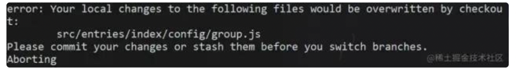

# git 重要命令

## 1. stash —— 作用—>保持轻爽的提交记录
<br>

#### 描述：
+ 官方解释：当您想记录工作目录和索引的当前状态，但又想返回一个干净的工作目录时，请使用git stash。该命令将保存本地修改，并恢复工作目录以匹配头部提交。
  

+ stash 命令能够将还未 commit 的代码存起来，让你的工作目录变得干净。


<br>

#### 应用场景：
+ 为什么要变干净？
  

+ 应用场景：某一天你正在 feature 分支开发新需求，突然产品经理跑过来说线上有bug，必须马上修复。而此时你的功能开发到一半，于是你急忙想切到 master 分支，然后你就会看到以下报错：<br>
  
  <br>
  因为当前有文件更改了，需要提交commit保持工作区干净才能切分支。由于情况紧急，你只有急忙 commit 上去，commit 信息也随便写了个“暂存代码”，于是该分支提交记录就留了一条黑历史…(真人真事，看过这种提交)


<br>  

#### 命令使用：
+ 如果你学会 stash，就不用那么狼狈了。你只需要：
  ```shell
  git stash
  ```
+   就这么简单，代码就被存起来了。

+ 当你修复完线上问题，切回 feature 分支，想恢复代码也只需要：
  ```shell
  git stash apply
  ```

<br>

#### 相关命令：
   ```shell
   # 保存当前未commit的代码
git stash

# 保存当前未commit的代码并添加备注
git stash save "备注的内容"

# 列出stash的所有记录
git stash list

# 删除stash的所有记录
git stash clear

# 应用最近一次的stash
git stash apply

# 应用最近一次的stash，随后删除该记录
git stash pop

# 删除最近的一次stash
git stash drop
   ```

当有多条 stash，可以指定操作stash，首先使用stash list 列出所有记录：<br>
```shell
$ git stash list
stash@{0}: WIP on ...
stash@{1}: WIP on ...
stash@{2}: On ...
```
应用第二条记录：<br>
```shell
$ git stash apply stash@{1}
```
pop，drop 同理。


