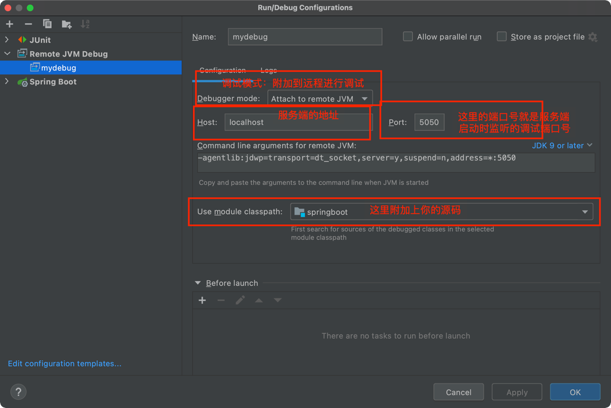

# jvm 远程调试

## 1. 其中一种远程调试的方式
+ 启动服务端
    ```java
    java -agentlib:jdwp=transport=dt_socket,server=y,suspend=y,address=5050 -jar springboot-0.0.1-SNAPSHOT.jar
    ```

+ 启动 IntelliJ IDEA 客户端 附加到远程进行调试
  

