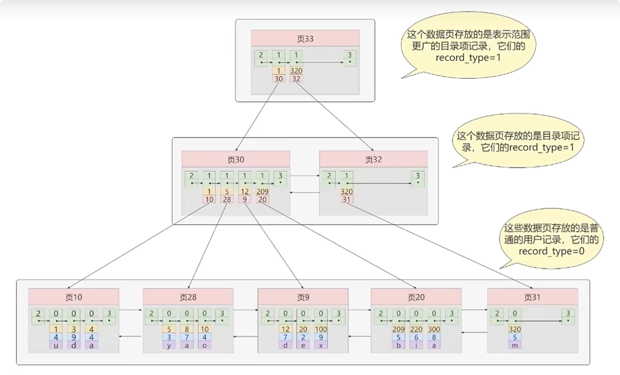
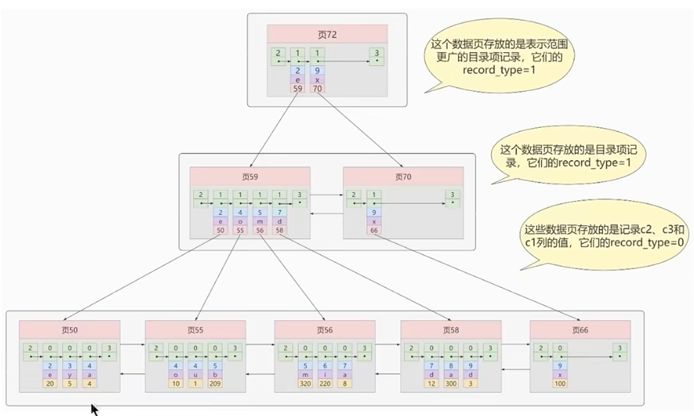

### sql执行流程
    1. 客户端 向 服务端 发起请求
    
    2. 服务端查询缓存，若缓存命中，则直接返回，否则进行步骤3 (缓存开关未开启也不会有查询缓存的过程，mysql8.0不再有这个缓存)
    
    3. 词法解析，语法解析，预处理器进行预处理
    
    4. 查询优化器进行优化
    
    5. 生成执行计划，交于存储引擎进行查询
    
    6. 缓存结果，返回结果
    
### mysql的profiling
```sql
-- 通过开启profiling来了解查询语句的执行过程及耗时
-- select @@profiling; 或者 show variables like '%profiling%'; 查看是否开启计划，开启它可以让mysql收集在sql执行时所使用的资源情况
mysql> select @@profiling;
mysql> show variables like '%profiling%';

-- 临时开启profiling
mysql> set profiling = 1;

-- 使用show profiles;查看语句的执行过程及耗时
mysql> show profiles;
```

### mysql缓存的开启
```sql
-- 查看缓存开关
mysql> show variables like 'query_cache_type';

-- 开启缓存(临时) 或者 配置文件新增：query_cache_type=1
mysql> set query_cache_type = 1;
```

### innodb缓冲池大小设置


### 默认innodb缓冲池的个数


### 查看mysql提供的存储引擎


### InnoDB和MyISAM的区别
    1. MyISAM不支持外键，InnoDB支持外键
    
    2. MyISAM不支持事务，InnoDB支持事务
    
    3. MyISAM是表级锁，即使操作一条记录也会锁住整张表，不适合高并发的操作
       InnoDB是行级锁，操作时只锁某一行，不对其他行有影响，适合高并发的操作
    
    4. MyISAM关注点是性能，节省资源，消耗少，简单业务  InnoDB关注事务，并发写，事务，更大资源

### 聚簇索引
    聚簇索引并不是一种单独的索引类型，而是一种数据存储方式（所有的数据记录都存储在了叶子节点），也就是所谓的索引即数据，数据即索引。
    
    术语"聚簇"表示数据行和相邻的键值聚簇的存储在一起
    
    特点：
        1. 使用记录主键值的大小进行记录和页的排序，这包括三个方面的含义：
            - 页内的记录是按照主键的大小顺序排成一个单向链表。
            - 各个存放用户记录的页也是根据页中用户记录的主键大小顺序的排成一个双向链表。
            - 存放目录项记录的页分为不同的层次，在同一层次中的页也是根据页中目录项记录的主键大小顺序的排成一个双向链表。
        2. B+树的叶子节点存储的是完整的用户记录。
            - 所谓完整的用户记录，就是指这个记录中存储了所有列的值（包括隐藏列）。
            
    我们把具有这两种特性的B+树称为聚簇索引，所有完整的用户记录都存放在这个聚簇索引的叶子节点处。
    这种聚簇索引并不需要我们在mysql语句中显示的使用index语句去创建，InnoDB存储引擎会自动的为我们创建聚簇索引。

    优点：
        - 数据访问更快，因为聚簇索引将索引和数据保存在同一个B+树中，因此从聚簇索引中获取数据比非聚簇索引更快。
        - 聚簇索引对于主键的排序查找和范围查找速度非常快。
        - 按照聚簇索引索引的排列顺序，查询显示一定范围数据的时候，由于数据都是紧密相连，数据库不用从多个数据块中提取数据，所以节省了大量的io操作。

    缺点：
        - 插入速度严重依赖插入顺序，按照主键的顺序插入是最快的方式，否则将会出现页分裂，严重影响性能。
          因此，对于InnoDB表，我们一般都会定义一个自增的ID列为主键
        - 更新主键的代价很高，因为将会导致被更新的行移动。因此，对于InnoDB表，我们一般定义主键为不可更新。
        - 二级索引访问需要两次索引查找，第一次找到主键值，第二次根据主键值找到行数据。

    限制：
        - 对于mysql数据库目前只有InnoDB数据引擎支持聚簇索引，而MyISAM并不支持聚簇索引。
        - 由于数据物理存储排序方式只能有一种，所以每个mysql的表只能有一个聚簇索引，一般情况下就是该表的主键。
        - 如果没有定义主键，InnoDB会选择非空的唯一索引代替。如果没有这样的索引，InnoDB会隐士的定义一个主键来作为聚簇索引。
        - 为了充分利用聚簇索引的聚簇的特性，所以InnoDB表的主键列尽量选用有序的顺序id，而不建议用无序的id，比如：uuid，md5，hash，字符串列作为主键无法保证数据的顺序增长。

#### 聚簇索引示例图：


### 二级索引（辅助索引，非聚簇索引）

```text
概念：回表
    我们根据这个以c2列大小排序的B+树只能确定我们要查找记录的主键值，所以如果我们想根据c2列的值查找到完整的用户记录的话，
    仍然需要到聚簇索引中再查一遍，这个过程称为回表。也就是根据c2列的值查询一条完整的用户记录需要使用到2棵B+树！
    
问题：为什么我们还要一次回表操作呢？直接把完整的用户记录放到叶子节点不行吗？
回答：
    如果把完整的用户记录放到叶子节点是可以不用回表，但是太占地方了，相当于每建立一棵B+树都需要把所有的用户记录再拷贝一遍，这就有点太浪费存储空间了。
    
因为这种按照非主键列建立的B+树需要一次回表操作才可以定位到完整的用户记录，所以这种B+树也被称为二级索引（英文名：secondary index），
或者辅助索引，由于我们使用的是c2列的大小作为B+树的排序规则，所以我们也称这个B+树是为c2列建立的索引。

非聚簇索引的存在不影响数据在聚簇索引中的组织，所以一张表可以有多个非聚簇索引。
```

### 联合索引

