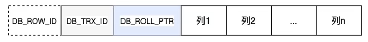
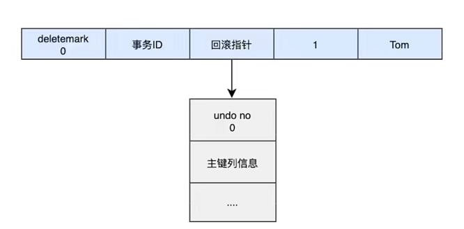
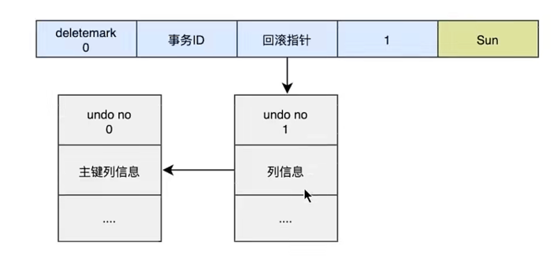
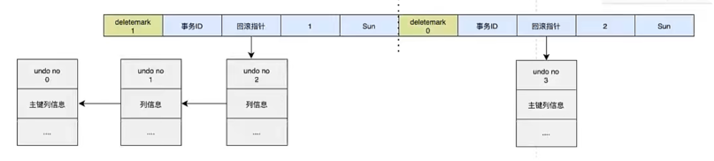

# undo日志
redo log 是事务持久性的保证，undo log是事务原子性的保证。在事务中```更新数据```的```前置操作```其实是要先写入一个```undo log```。

<br/><br/>
## 1. 如何理解undo日志
事务需要保证原子性，也就是事务中的操作要么全部完成，要么什么也不做。但是有时候事务执行到一半会出现一些情况，比如：
+ 情况一： 事务执行过程中可能遇到各种错误，比如```服务器本身的错误，操作系统错误```，甚至是突然```断电```导致的错误。
+ 情况二： 程序员可以在事务执行过程中手动输入```rollback```语句结束当前事务的执行
<br/>
  

以上情况出现，我们需要把数据改回原先的样子，这个过程称之为```回滚```，这样就可以造成一个假象：这个事务看起来什么都没做，所以符合```原子性```要求。
<br>

每当我们要对一条记录做改动时（这里的```改动```可以指```insert、delete、update```），都需要"留一手"——把回滚时所需要的东西记录下来。比如：
+ ```插入一条记录```时，至少要把这条记录的主键记下来，之后回滚的时候只需要把这个主键值对应的```记录删掉```就好了。（对于每个insert，innodb存储引擎会完成一个delete）
+ ```删除一条记录```，至少需要把这条记录中的内容都记下来，这样之后回滚时再把由这些内容组成的记录```插入```到表中就好了。（对于每个delete，innodb存储引擎会执行一个insert）
+ ```修改一条记录```，至少要把修改这条记录前的旧值都记录下来，这样之后回滚时再把这条记录```更新为旧值```就好了。（对于每个update，innodb存储引擎会执行一个相反的update，将修改前的行放回去）
<br>
  
mysql把这些为了回滚而记录的这些内容称之为```撤销日志```或者```回滚日志```（即```undo log```）。注意，由于查询操作（select）并不会修改任何用户记录，所以在查询操作执行时，并```不需要记录```相应的undo日志。
<br>

此外，undo log 也会产生 redo log ，也就是undo log的产生会伴随redo log的产生，这是因为undo log也需要持久性的保护。


<br/><br/>
## 2. undo日志的作用
+ 作用1：回滚数据 <br>
  用户对undo日志可能有误解：undo用于将数据库物理地恢复到执行语句或事务之前的样子。但事实并非如此。
  undo是逻辑日志，因此只是将数据库逻辑地恢复到原来的样子。所有修改都被逻辑地取消了，但是数据结构和页本身在回滚之后可能大不相同。
  <br>
  这是因为在多用户并发系统中，可能会有数十、数百甚至数干个并发事务。数据库的主要任务就是协调对数据记录的并发访问。
  比如，一个事务在修改当前一个页中某几条记录，同时还有别的事务在对同一个页中另几条记录进行修改。
  因此，不能将—个页回滚到事务开始的样子，因为这样会影响其他事务正在进行的工作。
  

+ 作用2：MVCC <br>
  undo的另一个作用是MVCC，即在InnoDB存储引擎中MVCC的实现是通过undo来完成。当用户读取一行记录时，
  若该记录已经被其他事务占用，当前事务可以通过undo读取之前的行版本信息，以此实现非锁定读取。


<br/><br/>
## 3. undo的类型
在InnoDB存储引擎中，undo log分为：

+ insert undo log <br>
  insert undo log是指在insert操作中产生的undo log。因为insert操作的记录，只对事务本身可见，对其他事务
  不可见（这是事务隔离性的要求），故该undo log可以在事务提交后直接删除。不需要进行purge操作。
  

+ update undo log <br>
  update undo log记录的是对delete 和 update操作产生的undo log。该undo log可能需要提供MVCC机制，因此不
  能在事务提交时就进行删除。提交时放入undo log链表，等待purge线程进行最后的删除。


<br/><br/>
## 4. undo log的生命周期
### 1. 简要生成过程
以下是undo+redo事务的简化过程 <br>
假设有2个数值，分别为A=1和B=2,然后将A修改为3，B修改为4
```text
1. start transaction;

2. 记录 A=1 到undo log;

3. update A = 3;

4. 记录 A=3 到redo log;

5. 记录 B=2 到undo log;

6. update B = 4;

7. 记录 B=4 到redo log;

8. 将redo log刷新到磁盘

9. commit
```
+ 在1-8步骤的任意一步系统宕机，事务末提交，该事务就不会对磁盘上的数据做任何影响． 
+ 如果在8-9之间宕机，恢复之后可以选择回滚，也可以选择继续完成事务提交，因为此时redo log已经持久化
+ 若在9之后系统宕机 内存映射中变更的数据还来不及刷回磁盘，那么系统恢复之后，可以根据redo log把数据刷回磁盘。


### 2. 详细生成过程
对于InnoDB引擎来说，每个行记录除了记录本身的数据之外，还有几个隐藏的列：
+ ```DB_ROW_ID```：如果没有为表显式的定义主键，并且表中也没有定义唯一索引，那么InnoDB会自动为表添加一个row_id的隐藏列作为主键。
+ ```DB_TRX_ID```：每个事务都会分配一个事务ID，当对某条记录发生变更时，就会将这个事务的事务ID写入trx_id中。
+ ```DB_ROLL_PTR```：回滚指针，本质上就是指向undo log的指针。<br>

<br>
  
当我们执行insert时：
```mysql
begin ;
insert into user(name) values ('tom');
```
插入的数据都会生成一条insert undo log，并且数据的回滚指针会指向它。undo log会记录undo log的序号、插入主键的列和值...，
那么在进行rollback的时候，通过主键直接把对应的数据删除即可。<br>

<br>

当我们执行update时：<br>
对于更新的操作会产生update undo log，并且会分更新主键的和不更新主键的，假设现在执行：
```mysql
update user set name = 'sun' where id = 1;
```

<br>
这时会把老的记录写入新的undo log，让回滚指针指向新的undo log，它的undo log是1，并且新的undo log会指向老的undo log（undo no=0）

假设现在执行：
```mysql
update user set id = 2 where id = 1;
```

<br>
对于更新主键的操作，会先把原来的数据deletemark标识打开，这时并没有真正的删除数据，真正的删除会交给清理线程去判断，
然后在后面插入一条新的数据，新的数据也会产生undo log，并且undo log的序号会递增。
<br>
可以发现每次对数据的变更都会产生一个undo log， 当一条记录被变更多次时，那么就会产生多条undo log，
undo log记录的是变更前的日志，并且每个undo log的序号是递增的，那么当要回滚的时候，按照序号依次向前推，就可以找到我们的原始数据了。


### 3. undo log是如何回滚的
以上面的例子来说，假设执行rollback，那么对应的流程应该是这样：
```text
1. 通过undo no=3的日志把id=2的数据删除

2. 通过undo no=2的日志把id=1的数据的deletemark还原成0

3. 通过undo no=1的日志把id=1的数据的name还原成Tom

4. 通过undo no=0的日志把id=1的数据删除
```


### 4. undo log的删除
+ 针对于insert undo log <br>
  因为insert操作的记录，只对事务本身可见，对其他事务不可见。故该undo log可以在事务提交后直接刪除，不需要进行purge操作。
  

+ 针对于update undo log <br>
  该undo log可能需要提供MVCC机制，因此不能在事务提交时就进行删除。提交时放入undo log链表，等待purge线程讲行最后的删除。


```text
purge线程两个主要作用是：清理undo页 和 清除page里面带有Delete_Bit标识的数据行。
在InnoDB中，事务中的Delete操作实际上并不是真正的删除掉数据行，而是一种Delete Mark操作，在记录上标识Delete_Bit， 
而不删除记录。是一种"假删除”只是做了个标记，真正的删除工作需要后台purge线程去完成。
```


