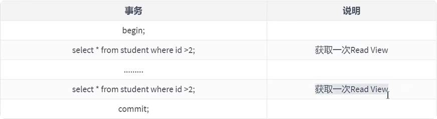
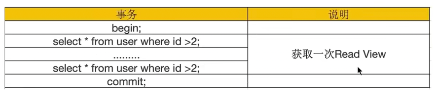
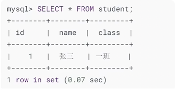
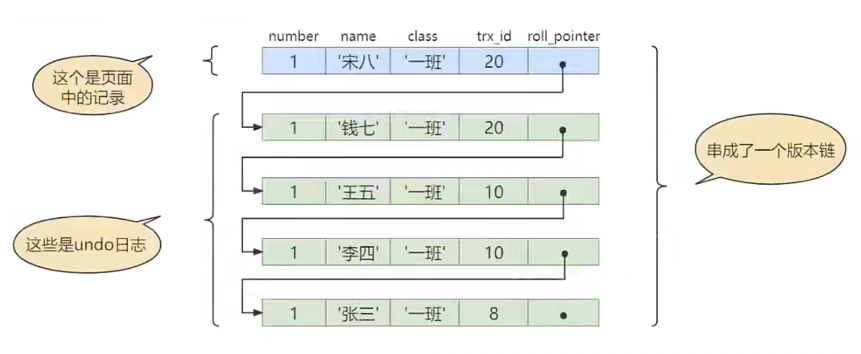
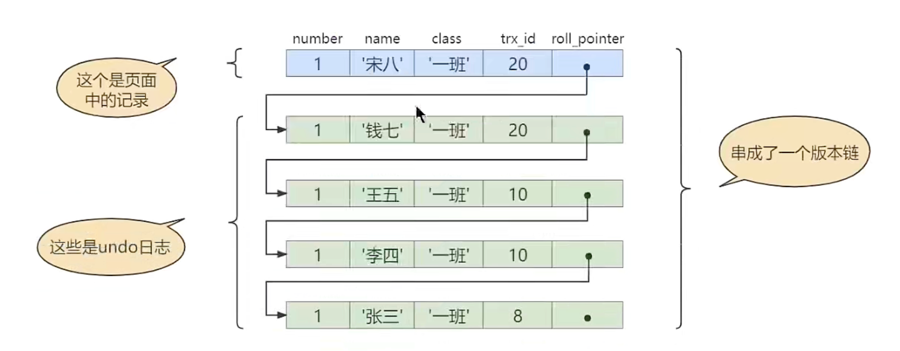
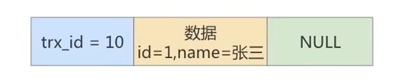
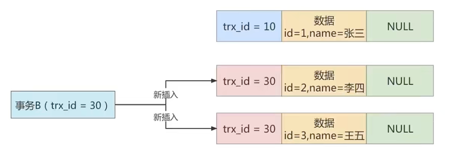
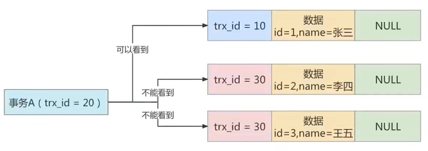

# MVCC_多版本并发控制

<br>
<br>

## 1. 什么是MVCC
MVCC (Multiversion Concurrency Control），多版本并发控制。顾名思义，MVCC 是通过数据行的多个版本管理来实现数据库的 ```并发控制```。
这项技术使得在InnoDB的事务隔离级别下执行 ```一致性读```操作有了保证。
换言之，就是为了查询一些正在被另一个事务更新的行，并旦可以看到它们被更新之前的值，这样在做查询的时候就不用等待另一个事务释放锁。


<br>
<br>

## 2. 快照读与当前读
MVCC在MySQL InnoDB中的实现主要是为了提高数据库并发性能，用更好的方式去处理```读-写冲突```，做到即使有读写冲突时，
也能做到 ```不加锁```， ```非阻塞并发读```，而这个读指的就是```快照读```，而非 ```当前读```。
当前读实际上是一种加锁的操作，是悲观锁的实现。而MVCC本质是采用乐观锁思想的一种方式。

### 2.1 快照读
快照读又叫一致性读，读取的是快照数据。**不加锁的简单的 SELECT 都属于快照读**，即不加锁的非阻塞读;
比如 这样：<br>
```mysql
SELECT * FROM player WHERE ... 
```
之所以出现快照读的情况，是基于提高并发性能的考虑，快照读的实现是基于MVCC，它在很多情况下，避免了加锁操作，降低了开销。

既然是基于多版本，那么快照读可能读到的并不一定是数据的最新版本，而有可能是之前的历史版本。

快照读的前提是隔离级别不是串行级别，串行级别下的快照读会退化成当前读。

### 2.2 当前读
当前读读取的是记录的最新版本(最新数据，而不是历史版本的数据），读取时还要保证其他并发事务不能修改当前记录，会对读取的记录进行加锁。
加锁的 SELECT，或者对数据进行增删改都会进行当前读。比如：
```mysql
SELECT * FROM student LOCK IN SHARE MODE; # 共享锁

SELECT * FROM student FOR UPDATE; # 排他锁

INSERT INTO student values ... ＃ 排他锁

DELETE FROM student WHERE ... ＃ 排他锁

UPDATE student SET ... ＃ 排他锁
```

<br>
<br>

## 3. MVCC实现原理之ReadView
MVCC的实现依赖于：**隐藏字段、undo log、read view**

### 3.1 什么是ReadView
在 MVCC 机制中，多个事务对同一个行记录进行更新会产生多个历史快照，这些历史快照保存在 Undo Log里。
如果一个事务想要查询这个行记录，需要读取哪个版本的行记录呢？这时就需要用到 ReadView 了，它帮我们解決了行的可见性问题。

ReadView 就是事务A在使用MVCC机制进行快照读操作时产生的读视图。当事务启动时，会生成数据库系统当前的一个快照，
InnoDB 为每个事务构造了一个数组，用来记录并维护系统当前 ```活跃事务``` 的ID（"活跃"指的就是，启动了但还没提交)。

### 3.2 设计思路
使用 ```READ UNCOMMITTED``` 隔离级别的事务，由于可以读到未提交事务修过的记录，所以直接读取记录的最新版本就好了。

使用 ```SERIALIZABLE``` 隔离级别的事务，InnoDB规定使用加锁的方式来访问记录。

使用 ```READ COMMITTED``` 和 ```REPEATABLE READ``` 隔离级别的事务，都必须保证读到 ```已经提交了的``` 事务修改过的记录，
假如另—个事务已经修改了记录但是尚末提交，是不能直接读取最新版本的记录的，核心问题就是需要判断一下版本链中的哪个版本是当前事务可见的，这是ReadView要解决的主要问题。

这个ReadView中主要包含4个比较重要的内容，分别如下：
1. creator_trx_id，创建这个Read View 的事务 ID。
   ```text
   说明：只有在对表中的记录做改动时（执行INSERT、DELETE、UPDATE这些语句时）才会为事务分配事务id，
        否则在一个只读事务中的事务id值都默认为0。
   ```
2. trx_ids, 表示在生成ReadView时当前系统中活跃的读写事务的```事务id列表```。
3. up_limit_id，活跃的事务中最小的事务ID。
4. low_limit_id，表示生成ReadView时系统中应该分配给下一个事务的id值。low_limit_id 是系统最大的事务id值，这里要注意是系统中的事务id，需要区别于正在活跃的事务ID。
   ```text
   注意：low_limit_id并不是trx_ids中的最大值，事务id是递增分配的。比如，现在有id为1，2，3这三个事务，之后id为3的事务提交了。
        那么一个新的读事务在生成ReadView时，trx_ids就包括1和2, up_limit_id的值就是1，low_limit_id的值就是4。
   ```


### 3.3 ReadView的规则
有了这个ReadView，这样在访问某条记录时，只需要按照下边的步骤判断记录的某个版本是否可见。 <br>

+ 如果被访问版本的trx_id厲性值与ReadView中的```creator_trx_id```值相同，意味着当前事务在访问它自己修改过的记录，所以该版本可以被当前事务访问。


+ 如果被访问版本的trx_id属性值小于ReadView中的```up_limit_id```值，表明生成该版本的事务在当前事务生成ReadView前已经提交，所以该版本可以被当前事务访问。
  

+ 如果被访问版本的trx_id属性值大于或等于ReadView中的```low_limit_id```值，表明生成该版本的事务在当前事务生成ReadView后才开启，所以该版本不可以被当前事务访问。


+ 如果被访问版本的trx_id属性值在ReadView的```up_limit_id```和```low_limit_id```之间，那就需要判断一下trx_id属性值是不是在```trx_ids```列表中。
  + 如果在，说明创建ReadView时生成该版本的事务还是活跃的，该版本不可以被访问。
  + 如果不在，说明创建ReadView时生成该版本的事务已经被提交，该版本可以被访问。


### 3.4 MVCC整体操作流程
了解了这些概念之后，我们来看下当查询一条记录的时候，系统如何通过MVCC找到它：
1. 首先获取事务自己的版本号，也就是事务ID；
   <br>
   <br>
2. 获取 ReadView;
   <br>
   <br>
3. 查询得到的数据，然后与 ReadView 中的事务版本号进行比较;
   <br>
   <br>
4. 如果不符合 ReadView 规则，就需要从 Undo Log 中获取历史快照;
   <br>
   <br>
5. 最后返回符合规则的数据。
   

如果某个版本的数据对当前事务不可见的话，那就顺着版本链找到下—个版本的数据，继续按照上边的步骤判断可见性，依此类推，直到版本链中的最后一个版本。
如果最后一个版本也不可见的话，那么就意味着该条记录对该事务完全不可见，查询结果就不包含该记录。 
```text
InnoDB中，MVCC 是通过 Undo Log + Read View进行数据读取，Undo Log 保存了历史快照，
而 Read View 规则帮我们判断当前版本的数据是否可见。
```
在隔离级别为读已提交 (Read Committed）时, 一个事务中的每一次 SELECT 查询都会重新获取一次 Read View. <br>

<br>
```text
注意：此时同样的查询语句都会重新获取一次Read View，这时如果Read View不同，就可能产生不可重复读或者幻读的情况。
```
<br>

当隔离级别为可重复读的时候，就避免了不可重复读，这是因为一个事务只在第一次 SELECT 的时候会获取一次 Read View， 而后面所有的 SELECT 都会复用这个 Read View. <br>

<br>


<br>
<br>

## 4. 举例说明
假设现在student表中只有一条由 ```事务id``` 为```8```的事务插入的一条记录： <br>

<br>
MVCC 只能在 READ COMMITTED 和 REPEATABLE READ 两个隔离级别下工作。接下来看一下 ```READ COMMITTED``` 和 ```REPEATABLE READ``` 所谓的生成ReadView的时机不同到底不同在哪里。

### 4.1 READ COMMITTED隔离级别下
**READ COMMITTED：每次读取数据前都生成一个ReadView.**

现在有两个```事务id```分别为```10```、```20``` 的事务在执行：
```mysql
# Transaction 10
BEGIN;
UPDATE student SET name = "李四" WHERE id = 1;
UPDATE student SET name = "王五" WHERE id = 1;
   
# Transaction 20
BEGIN;
# 更新了一些别的表的记录 I
...
```
```text
说明：事务执行过程中，只有在第一次真正修改记录时（比如使用INSERT、DELETE、UPDATE语句），才会被分配一个单独的事务id，这个事务id是递增的。
     所以我们才在事务20中更新一些别的表的记录，目的是让它分配事务id.
```
此刻，表 student 中```id```为```1```的记录得到的版本链表如下所示： <br>

<br>
假设现在有一个使用 ```READ COMMITTED``` 隔离级别的事务开始执行：
```mysql
# 使用READ COMMITTED隔离级别的事务
BEGIN;

# SELECT1: Transaction 10、20未提交
SELECT * FROM student WHERE id = 1;＃得到的列name的值为 张三，
```
这个 ```SELECT1``` 的执行过程如下： <br>
+ 步骤1：在执行 ```SELECT``` 语向时会先生成一个```ReadView```，ReadView的```trx_ids```列表的内容就是 [10， 20] ```up_limit_id``` 为 ```10```， ```low_limit_id```为 ```21```, ```creator_trx_id```为 ```0```。
  

+ 步骤2：从版本链中挑选可见的记录，从图中看出，最新版本的列```name```的内容是```王五```，该版本的```trx_id```值为```10```，在```trx_ids```列表内，所以不符合可见性要求，根据 ```roll_pointer```跳到下一个版本。


+ 步骤3：下一个版本的列```name```的内容是```李四```，该版本的```trx_id```值也为 ```10```，也在```trx_ids```列表内，所以也不符合要求，继续跳到下一个版本。


+ 步骤4：下一个版本的列```name```的内容是```张三```，该版本的```trx_id```值为```8```，小于```ReadView```中的```up_limit_id```值```10```，所以这个版本是符合要求的，最后返回给用户的版本就是这条列```name```为```张三```的记录.
<br>

之后，我们把 ```事务id``` 为```10```的事务提交一下： <br>
```mysql
# Transaction 10
BEGIN;

UPDATE student SET name = "李四" WHERE id = 1;
UPDATE student SET name = "王五" WHERE id = 1;
   
COMMIT;
```
然后再到 ```事务id``` 为```20```的事务中更新一下表 student 中 id 为 1 的记录： <br>
```mysql
# Transaction 20
BEGIN;

# 更新了一些别的表的记录
# ...

UPDATE student SET name= "钱七" WHERE id = 1;
UPDATE student SET name= "宋八" WHERE id = 1;
```
此刻，表student中 ```id``` 为 ```1``` 的记录的版本链就长这样： <br>

<br>
然后再到刚才使用 ```READ COMMITTED``` 隔离级别的事务中继续查找这个 ```id``` 为 ```1``` 的记录，如下：<br>
```mysql
# 使用READ COMMITTED隔离级别的事务
BEGIN;

# SELECT1: Transaction 10、20均未提交
SELECT * FROM student WHERE id = 1; # 得到的列name的值为 张三

# SELECT2: Transaction 10提交，Transaction 20未提交
SELECT * FROM student WHERE id = 1; # 得到的列name的值为 王五
```
这个 ```SELECT2``` 的执行过程如下： <br>
+ 步骤1：在执行 ```SELECT``` 语向时会又会单独生成一个 ```ReadView```，该ReadView的 ```trx_ids``` 列表的内容就是 [20], ```up_limit_id``` 为 ```20```， ```low_limit_id``` 为```21```,```creator_trx_id```为```0```。
  

+ 步骤2：从版本链中挑选可见的记录，从图中看出，最新版本的列```name```的内容是```‘宋八’```，该版本的```trx_id```值为```20```，在```trx_ids```列表内，所以不符合可见性要求，根据```roll_pointer```跳到下一个版本。


+ 步骤3：下一个版本的列```name```的内容是```钱七```，该版本的```trx_id```值为```20```，也在```trx_ids```列表内，所以也不符合要求，继续跳到下一个版本。


+ 步骤4：下一个版本的列```name```的内容是```王五```，该版本的```trx_id```值为```10```，小于 ```ReadView``` 中的```up_limit_id```值```20```，所以这个版本是符合要求的，最后返回给用户的版本就是这条列```name```为```王五```的记录。


### 4.2 REPEATABLE READ隔离级别下
使用 ```REPEATABLE READ``` 隔离级别的事务来说，只会在第一次执行查询语句时生成一个```ReadView```，之后的查询就不会重复生成了。

比如，系统里有两个 事务id 分别为 10、20的事务在执行：
```mysql
# Transaction 10
BEGIN;

UPDATE student SET name = '李四' WHERE id = 1 ;
UPDATE student SET name = '王五' WHERE id = 1 ;

# Transaction 20
BEGIN;
# 更新了一些别的表的记录
# ...
```
此刻，表 student 中 id 为 1 的记录得到的版本链表如下所示： <br>

<br>
假设现在有一个使用 ```REPEATABLE READ``` 隔离级别的事务开始执行：
```mysql
# 使用REPEATABLE READ隔离级别的事务
BEGIN;

# SELECT1: Transaction 10、20未提交
SELECT * FROM student WHERE id = 1; # 得到的列name的值为"张三，
```
这个 ```SELECT1``` 的执行过程如下： <br>
+ 步骤1：在执行 ```SELECT``` 语句时会先生成一个 ```ReadView```, ReadView的 ```trx_ids``` 列表的内容就是```[10， 20]```，```up_limit_id``` 为 ```10```,
  ```low_limit_id```为```21```, ```creator_trx_id```为```0```.
  

+ 步骤2：然后从版本链中挑选可见的记录，从图中看出，最新版本的列```name```的内容是```王五```，该版本的```trx_id```值为```10```，
  在```trx_ids```列表内，所以不符合可见性要求，根据 ```roll_pointer``` 跳到下一个版本。
  

+ 步骤3：下一个版本的列```name```的内容是```李四```，该版本的```trx_id```值也为```10```，也在```trx_ids```列表内，
  所以也不 符合要求，继续跳到下一个版本。
  

+ 步骤4：下一个版本的列```name```的内容是```张三```，该版本的```trx_id```值为```8```，小于```ReadView```中的 ```up_limit_id```值```10```，
  所以这个版本是符合要求的，最后返回给用户的版本就是这条列```name```为```张三```的记录。
  

之后，我们把```事务id```为```10```的事务提交一下，就像这样：
```mysql
# Transaction 10
BEGIN;

UPDATE student SET name = "李四" WHERE id = 1;
UPDATE student SET name = "王五" WHERE id = 1;

COMMIT;
```
然后再到 ```事务id``` 为```20```的事务中更新一下表 student 中 id 为 1 的记录：
```mysql
# Transaction 20
BEGIN;

# 更新了一些别的表的记录
# ...
UPDATE student SET name = "钱七" WHERE id = 1;
UPDATE student SET name = "宋八" WHERE id = 1;
```
此刻，表 student 中 id 为 1 的记录的版本链长这样：<br>

<br>
然后再到刚才使用 ```REPEATABLE READ``` 隔离级别的事务中继续查找这个 ```id``` 为 ```1``` 的记录，如下：
```mysql
# 使用REPEATABLE READ隔离级别的事务
BEGIN;

# SELECT1: Transaction 10、20均未提交
SELECT * FROM student WHERE id = 1; # 得到的列name的值为 张三

# SELECT2: Transaction 10提交，Transaction 20未提交
SELECT * FROM student WHERE id = 1; # 得到的列name的值仍为 张三
```
SELECT2 的执行过程如下： <br>
+ 步骤1：在执行 ```SELECT``` 语句时会使用之前的 ```ReadView```, ReadView的 ```trx_ids``` 列表的内容就是```[10， 20]```，```up_limit_id``` 为 ```10```,
  ```low_limit_id```为```21```, ```creator_trx_id```为```0```.


+ 步骤2：然后从版本链中挑选可见的记录，从图中看出，最新版本的列```name```的内容是```王五```，该版本的```trx_id```值为```10```，
  在```trx_ids```列表内，所以不符合可见性要求，根据 ```roll_pointer``` 跳到下一个版本。


+ 步骤3：下一个版本的列```name```的内容是```李四```，该版本的```trx_id```值也为```10```，也在```trx_ids```列表内，
  所以也不 符合要求，继续跳到下一个版本。


+ 步骤4：下一个版本的列```name```的内容是```张三```，该版本的```trx_id```值为```8```，小于```ReadView```中的 ```up_limit_id```值```10```，
  所以这个版本是符合要求的，最后返回给用户的版本就是这条列```name```为```张三```的记录。


两次 ```SELECT``` 查询得到的结果是重复的，记录的列值都是```张三```，这就是 ```可重复读``` 的含义。如果我们之后再把 ```事务id``` 为```20```的记录提交了，
然后再到刚才使用 ```PEPEATABLE READ```隔离级别的事务中继续查找这个 ```id``` 为```1```的记录，得到的结果还是```张三```。


### 4.3 如何解决幻读
假设现在表 student 中只有一条数据，数据内容中，主键 id=1，隐藏的trx_id=10，它的undo log 如下图所示。 <br>

<br>
假设现在有事务A 和 事务B 并发执行，```事务A```的事务id 为 20，```事务B```的事务id 为 ```30```。

步骤1：事务 A 开始第一次查询数据，查询的 SQL 语句如下。
```mysql
select * from student where id >= 1;
```
在开始查询之前，MySQL会为事务A产生一个ReadView，此时 ReadView 的内容如下：
```trx_ids=[20,30]```， ```up_limit_id=20```, ```low_limit_id=31```, ```creator_trx_id=20```.

由于此时表 student 中只有一条数据，且符合 where id >= 1 条件，因此会查询出来。
然后根据 ReadView 机制，发现该行数据的trx_id=10，小于事务A 的 ReadView 里 up_limit_id， 这表示这条数据是事务 A 开启之前，
其他事务就已经提交了的数据，因此事务 A 可以读取到。

结论：事务 A的第一次查询，能读取到一条数据，id=1。

步骤2：接着事务 B(trx_id=30），往表 student 中新插入两条数据，并提交事务。
```mysql
insert into student (id, name) values (2, '李四');

insert into student (id,name ) values (3, '王五');
```
此时表student 中就有三条数据了，对应的undo 如下图所示： <br>

<br>
步骤3：接着 事务A 开启第二次查询，根据可重复读隔离级别的规则，此时 事务A 并不会再重新生成 ReadView.
此时表 student 中的 3 条数据都满足 where id>=1 的条件，因此会先查出来。然后根据 ReadView 机制，判断每条数据是不是都可以被 事务A 看到.

+ 首先 id=1 的这条数据，前面已经说过了，可以被事务 A 看到。
  

+ 然后是 id=2的数据，它的trx_id=30，此时 事务A 发现，这个值处于 up_limit_id 和low_limit_id 之间，因此还需要再判断 30 是否处于 trx_ids 数组内。
  由于 事务A 的trx_ids=[20,30]，因此在数组内，这表示id=2 的这条数据是与 事务A 在同一时刻启动的其他事务提交的，所以这条数据不能让 事务A 看到。


+ 同理，id=3 的这条数据，trx_id 也为 30，因此也不能被 事务A 看见。 <br>

<br>
  
结论：最终 事务A 的第二次查询，只能查询出 id=1 的这条数据。这和 事务A 的第一次查询的结果是一样的，因此没有出现幻读现象，
所以说在 MysQL 的可重复读隔离级别下，不存在幻读问题.


<br>
<br>

## 总结
这里介绍了 ```MVCC``` 在 ```READ COMMITTD```、```REPEATABLE READ``` 这两种隔离级别的事务在执行快照读操作时访问记录的版本链的过程。
这样使不同事务的```读-写```、```写-读```操作并发执行，从而提升系统性能。

核心点在于 ReadView 的原理，```READ COMMITTD```、```REPEATABLE READ``` 这两个隔离级别的—个很大不同就是生成ReadView的时机不同：
+ ```READ COMMITTD``` 在每一次进行普通SELECT操作前都会生成一个ReadView
  

+ ```REPEATABLE READ``` 只在第一次进行普通SELECT操作前生成一个ReadView，之后的查询操作都重复使用这个ReadView就好了。


```text
说明：我们之前说执行DELETE语句或者更新主键的UPDATE语句并不会立即把对应的记录完全从页面中删除，
     而是执行一个所谓的delete mark操作，相当于只是对记录打上了一个删除标志位，
     这主要就是为MVCC服务的。
```
通过 MVCC 我们可以解决：
1. ```读写之间阻塞的问题```。通过 MVCC 可以让读写互相不阻塞，即读不阻塞写，写不阻塞读，这样就可以提升事务并发处理能力。
   <br>
   <br>
2. ```降低了死锁的概率```。这是因为 MVCC 采用了乐观锁的方式，读取数据时并不需要加锁，对于写操作，也只锁定必要的行。
   <br>
   <br>
3. ```解决快照读的问题```。当我们查询数据库在某个时间点的快照时，只能看到这个时间点之前事务提交更新的结果，而不能看到这个时间点之后事务提交的更新结果。


