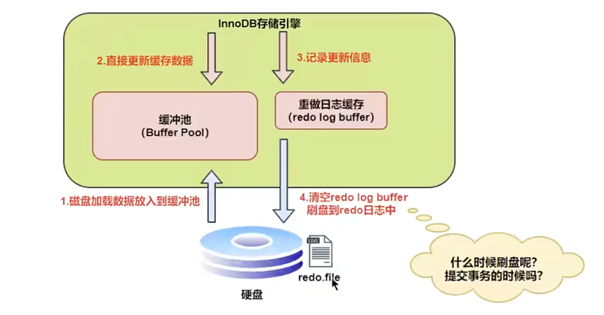
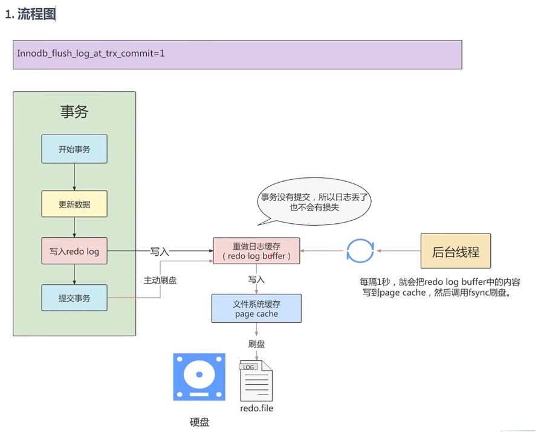
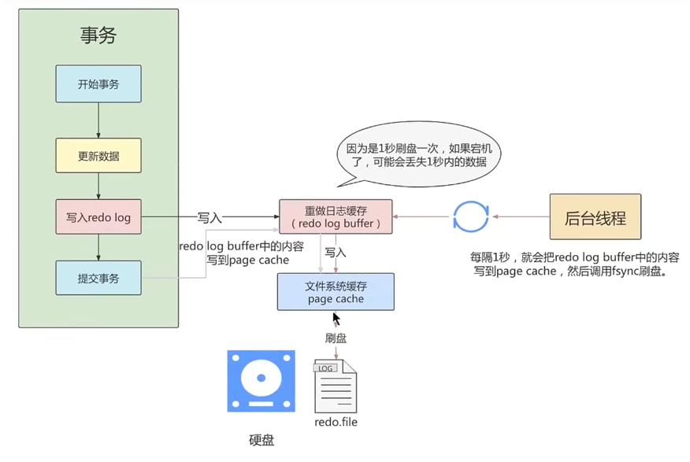
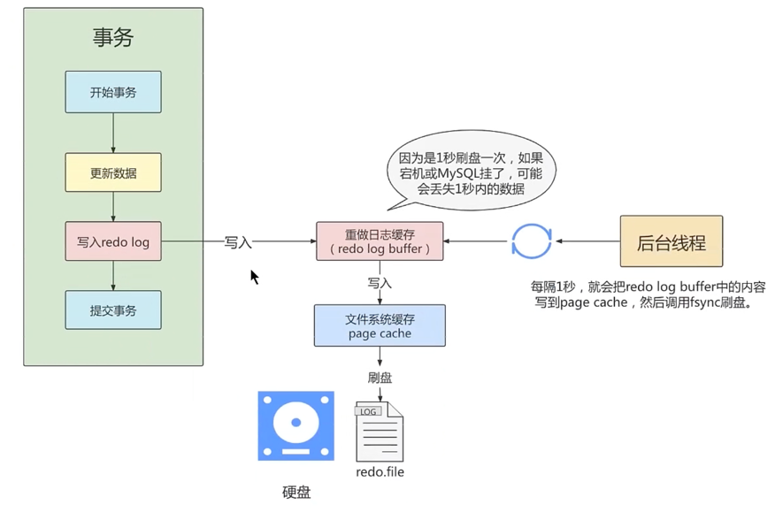

# redo日志
## 1. 为什么需要redo日志
+ 一方面，缓冲池可以帮助我们消除cpu和磁盘之间的鸿沟，checkpoint机制可以保证数据的最终落盘，然而由于checkpoint并不是每次变更的时候就触发的，
  而是master线程隔一段时间去处理的。所以最坏的情况就是事务提交后，刚写完缓冲池，数据库宕机了，那么这段数据就是丢失的，无法恢复。
  

+ 另一方面，事务包含持久性的特性，就是说对于一个已经提交的事务，在事务提交后即使系统发生了崩溃，这个事务对数据库中所做的修改也不能丢失。
  

+ 那么如何保证这个持久性呢?，一个简单的做法：在事务提交完成之前把该事务所修改的所有页面都刷新到磁盘，但是这个简单粗暴的做法有些问题：
    + 修改量与刷新磁盘工作量严重不成比例
      有时候我们仅仅修改了某个页面中的一个字节，但是我们知道在InnoDB中是以页为单位来进行磁盘I/O的，
      也就是说我们在该事务提交时不得不将一个完整的页面从内存中刷新到磁盘，我们又知道一个页面默认是16KB大小，
      只修改一个字节就要刷新16KB的数据到磁盈上显然是太小题大做了。
    + 随机I/O刷新较慢
      一个事务可能包含很多语句，即使是一条语句也可能修改许多页面，假如该事务修改的这些页面可能并不相邻，
      这就意味着在将某个事务修改的Buffer Pool中的页面 刷新到磁盘 时，需要进行很多的随机IO，
      随机IO比顺序IO要慢，尤其对于传统的机械硬盘来说 
      

+ 另一个解决的思路：我们只是想让已经提交了的事务对数据库中数据所做的修改永久生效，即使后来系统崩溃，在重启后也能把这种修改恢复出来。
    所以我们其实没有必要在每次事务提交时就把该事务在内存中修改过的全部页面刷新到磁盘，只需要把修改了哪些东西记录一下就好。
    比如，某个事务将系统表空间中 第10号页面中偏移量为180处的那个字节的值1改成2。我们只需要记录一下：将第0号表空间的10号页面的偏移量为180处的值更新为2。
  

+ InnoDB引擎的事务采用了WAL技术(write-Ahead Logging），这种技术的思想就是先写日志，再写磁盘，只有日志写入成功，才算事务提交成功，
    这里的日志就是redo log。 当发生宕机且数据未刷到磁盘的时候，可以通过redo log来恢复，保证ACID中的D，这就是redo log的作用。


## 2. redo日志的好处、特点
+ 好处
    + redo日志降低了刷盘的频率
    + redo日志占用的空间非常小
      <br> 存储表空间id、页号、偏移量以及需要更新的值，所需的存储空间是很小的，刷盘快。


+ 特点
    + redo日志是顺序写入磁盘的
      <br>在执行事务的过程中，每执行一条语句，就可能产生若干条redo日志，这些日志是按照产生的顺序写入磁盘的，也就是使用顺序IO，效率比随机IO快。
    + 事务执行过程中，redo log不断记录
      <br>redo log 跟bin log的区别，redo log是存储引擎层产生的，而bin log是数据库层产生的。假设一个事务，对表做 10万行的记录插入，在这个过程中，
      一直不断的往redo log顺序记录，而bin log不会记录，直到这个事务提交，才会一次写入到bin log文件中。


## 3. redo log的组成
+ redo log可以简单分为以下两个部分：
    + 重做日志的缓冲（redo log buffer），保存在内存中，是易失的。
      <br>在服务器启动时就向操作系统申请了一大片称之为redo log buffer的 连续内存 空间，翻译成中文就是redo日志缓冲区。
      这片内存空间被划分成若干个连续的redo log block。一个redo log block占用 512字节 大小。

    + 重做日志文件（redo log file），保存在硬盘中，是持久的。


## 4. redo的整体流程
以一个更新事务为例，redo log流转过程，如下图所示：

```text
第1步：先将原始数据从磁盘中读入内存中，修改数据的内存拷贝

第2步：生成一条重做日志并写入redo log buffer，记录的是数据被修改后的值

第3步：当事务commit时，将redo log buffer中的内容刷新到 redo log file，对redo log file采用追加写的方式

第4步：定期将内存中修改的数据刷新到磁盘中
```
```text
Write-Ahead Log(预先日志持久化)：在持久化一个数据页之前，先将内存中相应的日志页持久化。
```


## 5. redo log的刷盘策略
redo log的写入并不是直接写入磁盘的，InnoDB引擎会在写redo log的时候先写redo log buffer，之后以一定的频率
刷入到真正的redo log file 中。这里的一定频率怎么看待呢？这就是我们要说的刷盘策略。

<br>
注意，redo log buffer 刷盘到redo log file的过程并不是真正的刷到磁盘中去，只是刷入到文件系统缓存 (page cache）中去（这是现代操作系统为了提高文件写入效率做的一个优化），
真正的写入会交给系统自己来决定（比如page cache足够大了）。那么对于InnoDB来说就存在一个问题，如果交给系统来同步，同样如果系统宕机，那么数据也丢失了（虽然整个系统宕机的概率还是比较小的）。
<br>
针对这种情況，InnoDB给出 innodb_flush_log_at_trx-commit 参数，该参数控制commit提交事务时，如何将redo log buffer 中的日志刷新到redo log file中。它支持三种策略:
+ ```设置为0```：表示每次事务提交时不进行刷盘操作。（系统默认master thread每隔1s进行一次重做日志的同步） 
+ ```设置为1```：表示每次事务提交时都将进行同步，刷盘操作（默认值）
  ```mysql
  show variables like 'innodb_flush_log_at_trx_commit';
  ```
+ ```设置为2```：表示每次事务提交时都只把redo log buffer 内容写入page cache，不进行同步。由os自己决定什么时候同步到磁盘文件。


## 6. 不同的刷盘策略
### 1. innodb_flush_log_at_trx_commit = 1;
```mysql
set innodb_flush_log_at_trx_commit = 1;
```

```text
小结：innodb_flush_log_at_trx_commit=1

为1时，只要事务提交成功，redo log 记录就一定在硬盘里，不会有任何数据丢失。

如果事务执行期间 MysQL挂了或宕机，这部分日志丢了，但是事务并没有提交，所以日志丢了也不会有损失。
可以保证ACID的D，数据绝对不会丟失，但是效率最差的。

建议使用默认值，虽然操作系统宕机的概率理论小于数据库宕机的概率，但是一般既然使用了事务，
那么数据的安全相对来说更重要些。
```

### 2. innodb_flush_log_at_trx_commit = 2;
````mysql
set innodb_flush_log_at_trx_commit = 2;
````

```text
小结 innodb_flush_log_at_trx_commit=2

为2时，只要事务提交成功，redo log buffer 中的内容只写入文件系统缓存(page cache)。

如果仅仅只是MySQL挂了不会有任何数据丢失，但是操作系统宕机可能会有1秒数据的丢失，
这种情况下无法满足ACID中的D。但是数值2肯定是效率最高的。
```


### 3. innodb_flush_log_at_trx_commit = 0;
````mysql
set innodb_flush_log_at_trx_commit = 0;
````

```text
小结：innodb_flush_log_at_trx_commit=0

为0时，master thread中每1秒进行一次重做日志的fsync操作，因此实例 crash 最多丢失I秒钟内的事务。
(master thread是负责将缓冲池中的数据异步刷新到磁盘，保证数据的一致性）

数值0的话，是一种折中的做法，它的IO效率理论是高于1的，低于2的，这种策略也有丢失数据的风险，也无法满足ACID中的D
```


