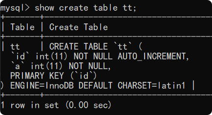
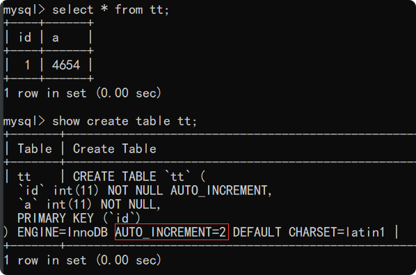
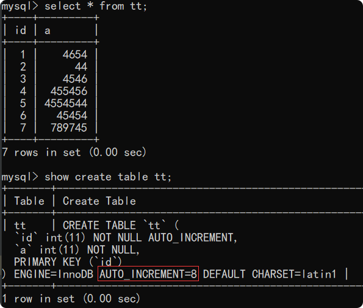
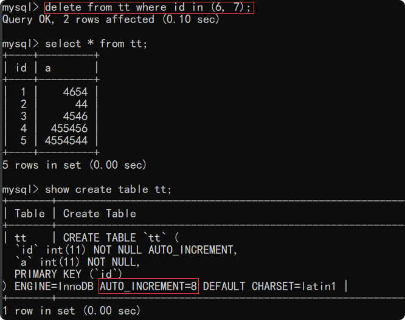
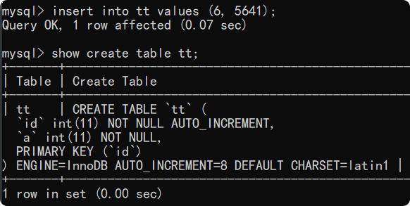
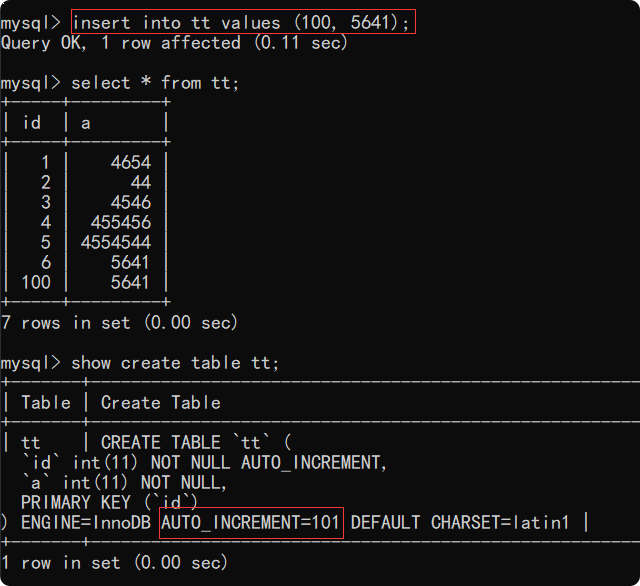
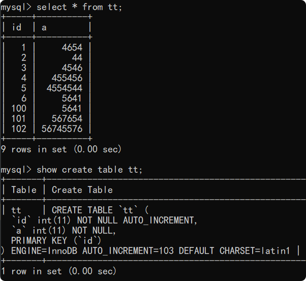
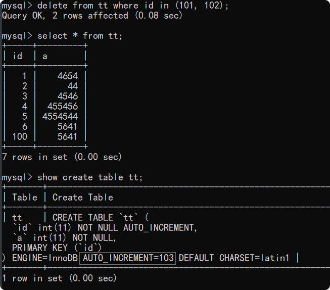
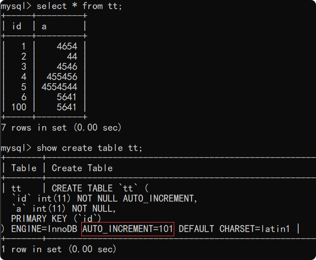

# mysql的自增主键

+ ```自增主键```可以让主键索引尽量的保持```递增顺序插入```，避免了页分裂，大量的```随机I/O```；
<br>

+ ```自增主键```有时候是```不连续的```，```自增主键```会出现“断层”
<br>

为了形象的说明问题我们创建一个简单的表用于演示
```mysql
create table tt (
    id int auto_increment primary key ,
    a int not null
);
```
<br>
<br>
表刚创建时的表情况：<br>   


<br>
<br>
<br>

插入一条记录后的表情况：<br>

<br>
<br>
<br>

连续多插入几条记录后的表情况：<br>

<br>
<br>
<br>

此时，删除主键id为6、7的两条记录，之后表的情况：<br>

<br>
<br>
<br>

此时执行添加语句，如下，是可以成功的，当插入数据的时候如果指定```主键id```，那么```主键id```在```不冲突```的情况下就以我们
指定的id为准。
```mysql
insert into tt values (6, 5641);
```


请注意，此时```AUTO_INCREMENT=8```，并没有发生变化，说明当我们指定的```主键id```小于```AUTO_INCREMENT```的值的时候，```AUTO_INCREMENT```不会自增。
<br>
此时执行下面这条添加语句：<br>
```mysql
insert into tt values (100, 5641);
```

<br>
请注意此时表的情况，```AUTO_INCREMENT```的值已经变为```101```，说明当我们指定的```主键id大于AUTO_INCREMENT的值```的时候，```AUTO_INCREMENT```就会在我们
指定的基础上```自增加一```。
<br>
<br>
<br>
<br>
再执行两条添加语句，```主键id```使用```自动生成```
```mysql
insert into tt values (null, 567654);
insert into tt values (null, 56745576);
```

<br>
<br>
<br>

这时，删除```id```为```101```, ```102```的这两条记录。
```mysql
delete from tt where id in (101, 102);
```

<br>
此时```AUTO_INCREMENT=103```；
<br>
请注意：**这个时候重启MySQL服务！！！**
<br>
重启之后的表情况：
<br>

<br>
请注意：这个时候 ```AUTO_INCREMENT=101``` 发生了变化，从```103```回退到了```101```
<br>
这说明了```AUTO_INCREMENT```的值并没有```持久化```（在```MySQL8.0```的版本才做了持久化），它是```保存在内存```当中的。


<br>
<br>
<br>
<br>

## 小结：
+ myisam 引擎的自增值保存在数据文件中。

+ innodb 引擎的自增值，其实是保存在了内存里，并且到了mysql8.0版本后，才有了“自增值持久化”的能力，
  也就是才实现了“如果发生重启，表的自增值可以恢复为mysql重启前的值”，具体情况是：
  + 在mysql5.7及之前的版本，自增值保存在内存里，并没有持久化。每次重启后，第一次打开表的时候，都会去找自增值的最大值max(id)，然后将max(id)+1作为这个表当前的自增值。
  
  + 在mysql8.0版本，将自增值的变更记录在了redo log中，重启的时候依靠redo log恢复到重启之前的值。
  
  
+ 自增主键id没有连续递增的原因：
  + 在我们指定id的时候，没有发生主键冲突的情况将记录插入进去，此时主键id就发生了断续
  
  + 事务回滚也会产生主键id的断续

