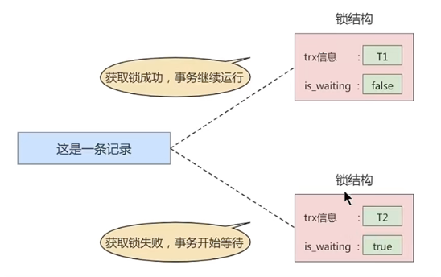

# MySQL_锁
事务的```隔离性```由锁来实现

<br/><br/>
## 1. 概述
在数据库中，除传统的计算资源（如CPU、RAM、I/O）的争用以外，数据也是一种供许多用户共享的资源。为保证数据的一致性，需要对```并发操作进行控制```，
因此产生了锁。同时```锁机制```也为实现mysql的各个隔离级别提供了保证。```锁冲突```也是影响数据库```并发访问性能```的一个重要因素。
所以锁对数据库而言显得尤其重要，也更加复杂。


<br/><br/>
## 2. mysql并发事务访问相同记录
并发事务访问相同记录的情况大致可以划分为三种：
+ 读-读情况 <br>
  ```读-读```情况，即并发事务相继```读取相同的记录```。读取操作本身不会对记录有任何影响，并不会引起什么问题，所以允许这种情况的发生。
  

+ 写-写情况 <br>
  ```写-写```情况，即并发事务相继对相同的记录做出改动。<br>
  这种情况下会发生```脏写```的问题，任何一种隔离级别都不允许这种问题的发生。所以在多个未提交事务相继对一条记录做改动时，需要让它们```排队执行```，
  这个排队的过程其实是通过```锁```来实现的。这个所谓的锁其实是一个```内存中的结构```，在事务执行前本来是没有锁的，也就是说一开始是没有```锁结构```和记录进行关联的，如图所示：<br>
  
  <br>
  当一个事务想对这条记录做改动时，首先会看看内存中有没有与这条记录关联的```锁结构```，当没有的时候就会在内存中生成一个```锁结构```与之关联。
  比如，事务T1要对这条记录做改动，就需要生成一个```锁结构```与之关联：<br>
  
  <br>
  在```锁结构```里有很多信息，为了简化理解，只把两个比较重要的属性拿了出来：<br>
  + ```trx```：代表这个锁结构是哪个事务生成的。
  + ```is_waitting```：代表当前事务是否在等待。<br>
  
  当事务```T1```改动了这条记录后，就生成了一个```锁结构```与该记录关联，因为之前没有别的事务为这条记录加锁，所以```is_waiting```属性就是```false```，
  我们把这个场景就称之为```获取锁成功```，或者```加锁成功```，然后就可以继续执行操作了。<br>
  在事务```T1```提交之前，另一个事务```T2```也想对该记录做改动，那么先看看有没有```锁结构```与这条记录关联，发现有一个```锁结构```与之关联后，
  然后也生成一个锁结构与这条记录关联，不过锁结构的```is_waiting```属性为```true```，表示当前事务需要等待，我们把这个场景就称之为```获取锁失败```，或者```加锁失败```，图示：<br>
  
  <br>
  在事务T1提交之后，就会把该事务生成的```锁结构释放```掉，然后看看还有没有别的事务在等待获取锁，发现了事务T2还在等待获取锁，所以把事务T2对应的锁结构的```is_waiting```属性设置为```false```，
  然后把该事务对应的线程唤醒，让它继续执行，此时事务T2就算获取到了锁。效果图如下：<br>
  
  <br>
  小结几种说法：
  + 不加锁 <br>
    意思就是不需要在内存中生成对应的```锁结构```，可以直接执行操作。
  + 获取锁成功，或者加锁成功 <br>
    意思就是在内存中生成了对应的```锁结构```，而且锁结构的```is_waiting```属性为```false```，也就是事务可以继续执行操作。
  + 获取锁失败，或者加锁失败，或者没有获取到锁 <br>
    意思就是在内存中生成了对应的```锁结构```，不过锁结构的```is_waiting```属性为```true```，也就是事务需要等待，不可以继续执行操作。
    

+ 读-写或写-读情况 <br>
  ```读-写```或```写-读```，即一个事务进行读取操作，另一个事务进行改动操作。这种情况下可能发生```脏读```、```不可重复读```、```幻读```的问题。
  <br>
  各个数据库厂商对```sql标准```的支持都可能不一样。比如mysql在```repeatable read```隔离级别上就已经解决了```幻读```问题。


<br/><br/>
## 3. 并发问题的解决方案
怎么解决```脏读```、```不可重复读```、```幻读```这些问题呢？其实有两种可选的解决方案：<br>
+ 方案一：读操作利用多版本并发控制MVCC，写操作进行加锁。<br>
  所谓```mvcc```，就是生成一个```ReadView```，通过ReadView找到符合条件的记录版本（历史版本由```undo日志```构建）。查询语句只能```读```到在生成ReadView之前```已提交事务所做的更改```，
  在生成ReadView之前未提交的事务或者之后才开启的事务所做的更改是看不到的。而```写操作```肯定针对的是```最新版本的记录```，读记录的历史版本和改动记录的最新版本本身并不冲突，也就是采用MVCC时，读-写操作并不冲突。
  <br>
  ```text
  普通的SELECT语句 在READ COMMITTED和REPEATABLE READ隔离级别下会使用到MVCC读取记录。
  
  • 在READ COMMITTED 隔离级别下，一个事务在执行过程中每次执行SELECT操作时都会生成一个ReadView, 
    ReadView的存在本身就保证了 事务不可以读取到未提交的事务所做的更改，也就是避免了脏读现象；
  
  • 在REPEATABLE READ 隔离级别下，一个事务在执行过程中只有 第一次执行SELECT操作 才会生成一个ReadView， 
    之后的SELECT操作都复用 这个ReadView，这样也就避免了不可重复读和幻读的问题。
  ```
  

+ 方案二：读、写操作都采用加锁的方式 <br>
  如果我们的一些业务场景不允许读取记录的旧版本，而是每次都心须去```读取记录的最新版本```。比如，在银行存款的事务中，你需要先把账户的余额读出来，然后将其加上本次存款的数额，最后再写到数据库中。
  在将账户余额读取出来后，就不想让别的事务再访问该余额，直到本次存款事务执行完成，其他事务才可以访问账户的余额。
  这样在读取记录的时候就需要对其进行```加锁```操作，这样也就意味着```读```操作和```写```操作也像```写-写```操作那样```排队```执行。
  <br>
  <br>
  ```脏读```的产生是因为当前事务读取了另一个未提交事务写的一条记录，如果另一个事务在写记录的时候就给这条记录加锁，
  那么当前事务就无法继续读取该记录了，所以也就不会有脏读问题的产生了。
  <br>
  <br>
  ```不可重复读```的产生是因为当前事务先读取一条记录，另外一个事务对该记录做了改动之后并提交之后，当前事务再次读取时会获得不同的值，
  如果在当前事务读取记录时就给该记录加锁，那么另一个事务就无法修改该记录，自然也不会发生不可重复读了。
  <br>
  <br>
  ```幻读```问题的产生是因为当前事务读取了—个范围的记录，然后另外的事务向该范围内插入了新记录，
  当前事务再次读取该范围的记录时发现了新插入的新记录。采用加锁的方式解决幻读问题就有一些麻烦，因为当前事务在第一次读取记录时幻影记录并不存在，
  所以读取的时候加锁就有点尴尬（因为你并不知道给谁加锁）
  <br>
  <br>
  + 小结：
    + 采用```MVCC```方式的话，```读-写```操作彼此并不冲突，```性能更高```。
    + 采用```加锁```方式的话，```读-写```操作彼此需要```排队执行```，影响性能。
      <br>
      <br>
      一般情况下我们当然愿意采用```MVCC```来解决```读-写```操作并发执行的问题，但是业务在某些特殊情况下，要求必须采用```加锁```的方式执行。


<br/><br/>
## 4. 锁
## 4.1  从数据操作的类型划分：读锁、写锁
对于数据库中并发事务的```读-读```情况并不会引起什么问题。对于```写-写```、```读-写```或```写-读```这些情况可能会引起一些问题，
需要使用```MVCC```或者```加锁```的方式来解决它们。在使用```加锁```的方式解决问题时，由于既要允许```读-读```情况不受影响，
又要使```写-写```、```读-写```或```写-读```情况中的操作```相互阻塞```，所以MysQL实现一个由两种类型的锁组成的锁系统来解决。
这两种类型的锁通常被称为 共享锁 (Shared Lock, SLock）和 排他锁 (Exclusive Lock. x Lock). 也叫 读锁 (read lock）和写锁 (write lock)
+ 读锁：也称为 共享锁、英文用 S 表示。针对同一份数据，多个事务的读操作可以同时进行而不会互相影响，相互不阻塞的。

+ 写锁：也称为 排他锁、英文用 X 表示。当前写操作没有完成前，它会阻断其他写锁和读锁。这样就能确保在给定的时间里，只有一个事务能执行写入，并防止其他用户读取正在写入的同一资源。

**需要注意的是对于 InnoDB 引擎来说，读锁和写锁可以加在表上，也可以加在行上。**
<br>
**举例（行级读写锁）**：如果一个事务 T1 已经获得了某个行r的读锁，那么此时另外的一个事务 T2 是可以去获得这个行r的读锁的，
因为读取操作并没有改变行的数据; 但是，如果某个事务 T3 想获得行r的写锁，则它必须等待事务 T1、T2 释放掉行r上的读锁才行。
<br>

|  | X锁  | S锁 |
| :------| ------: | :---:|
| X锁 | 不兼容 | 不兼容|
| S锁 | 不兼容 | 兼 容 |
<br>

### 1. 锁定读
在采用```加锁```方式解决```脏读```、```不可重复读```、```幻读```这些问题时，读取一条记录时需要获取该记录的```S锁```，其实是不严谨的，
有时候需要在读取记录时就获取记录的```X锁``` ，来禁止别的事务读写该记录，为此MysQL提出了两种比较特殊的 SELECT 语句格式：
+ 对读取的记录加```S锁```：
  ```mysql
  select ... lock in share mode ;
  #或
  select ... for share ; #(8.0新增语法)
  ```
  在普通的```SELECT```语向后边加```LOCK IN SHARE MODE```，如果当前事务执行了该语句，那么它会为读取到的记录加```S锁```，这样允许别的事务继续获取这些记录的```S锁``` 
  （ 比方说别的事务也使用```SELECT ... LOCK IN SHARE MODE``` 语向来读取这些记录），但是不能获取这些记录的```X锁```（比如使用```SELECT ... FOR UPDATE``` 语句来读取这些记录，或者直接修改这些记录）。
  如果别的事务想要获取这些记录的```X锁```，那么它们会阻塞，直到当前事务提交之后将这些记录上的```S锁```释放掉。
  

+ 对读取的记录加X锁：<br>
  ```mysql
  select ... for update; 
  ```
  在普通的```SELECT```语句后边加```FOR UPDATE```，如果当前事务执行了该语句，那么它会为读取到的记录加```X锁```，
  这样既不允许别的事务获取这些记录的```S锁```（比方说别的事务使用```SELECT ... LOCK IN SHARE MODE``` 语句来读取这些记录），
  也不允许获取这些记录的```X锁```（比如使用 ```SELECT ... FOR UPDATE``` 语句来读取这些记录，或者直接修改这些记录）。
  如果别的事务想要获取这些记录的```S锁```或者```X锁```，那么它们会阻塞，直到当前事务提交之后将这些记录上的```X锁```释放掉。 

<br>

### 2. 写操作
平常所用到的```写操作```无非是```DELETE```、```UPDATE```、 ```INSERT```这三种：
+ ```DELETE```: <br>
  对一条记录做```DELETE```操作的过程其实是先在```B+```树中定位到这条记录的位置，然后获取这条记录的```X锁```，再执行```delete mark```操作。
  我们也可以把这个定位待删除记录在B+树中位置的过程看成是一个获取```X锁```的锁定读。
+ ```UPDATE```：在对一条记录做UPDATE操作时分为三种情况：
  + 情況1：未修改该记录的键值，并且被更新的列占用的存储空间在修改前后末发生变化。
    则先在```B+```树中定位到这条记录的位置，然后再获取一下记录的```X锁```，最后在原记录的位置进行修改操作。
    我们也可以把这个定位待修改记录在```B+```树中位置的过程看成是一个获取```X锁```的```锁定读```。
  + 情况2：未修改该记录的键值，并且至少有一个被更新的列占用的存储空间在修改前后发生变化。
    则先在```B+```树中定位到这条记录的位置，然后获取一下记录的```X锁```，将该记录彻底删除掉（就是把记录彻底移入垃圾链表），最后再插入一条新记录。
    这个定位待修改记录在B+树中位置的过程看成是一个获取```X锁```的```锁定读```，新插入的记录由```INSERT```操作提供的```隐式锁```进行保护。
  + 情况3：修改了该记录的键值，则相当于在原记录上做```DELETE```操作之后再来一次```INSERT```操作，加锁操作就需要按照```DELETE```和```INSERT```的规则进行了。
  
+ ```INSERT```: <br>
  一般情况下，新插入一条记录的操作并不加锁，通过一种称之为```隐式锁```的结构来保护这条新插入的记录在本事务提交前不被别的事务访问。


<br>
<br>
<br>

## 4.2 从数据操作的粒度划分：表级锁、页级锁、行锁
为了尽可能提高数据库的并发度，每次锁定的数据范围越小越好，理论上每次只锁定当前操作的数据的方案会得到最大的并发度，但是管理锁是```耗资源```的事情（涉及获取、检查、释放锁等动作）。
因此数据库系统需要在```高并发响应```和```系统性能```两方面进行平衡，这样就产生了```“锁粒度（lock granularity）”```的概念。

对一条记录加锁影响的也只是这条记录，我们就说这个锁的粒度比较细；其实一个事务也可以在```表级别```进行加锁，自然就被称之为```表级锁```或者```表锁```，
对一个表加锁影响整个表中的记录，我们就说这个锁的粒度比较粗。锁的粒度主要分为表级锁、页级锁和行锁

### 1. 表锁（table lock）
该锁会锁定整张表，它是mysql中最基本的锁策略，并```不依赖于存储引擎```（不管你是mysql的什么存储引擎，对于表锁的策略都是一样的），并且表锁是```开销最小```的策略（因为粒度比较大）。
由于表级锁一次会将整个表锁定，所以可以很好的```避免死锁```问题。当然，锁的粒度大所带来最大的负面影响就是出现锁资源争用的概率也会最高，导致```并发率大打折扣```。


+ 在对某个表执行select、insert、delete、update语句时，innodb存储引擎是不会为这个表添加表级别的```S锁```或者```X锁```的。
在对某个表执行一些诸如```alter table```、```drop table```这类的```DDL```语句时，其他事务对这个表并发执行诸如select、insert、delete、update的语句会发生阻塞。
同理，某个事务中对某个表执行select、insert、delete、update语句时，在其他会话中对这个表执行```DDL```语句也会发生阻塞。
这个过程其实是通过在```server层```使用一种称之为```元数据锁```（英文名：```metadata locks```，简称```MDL```）结构来实现的。


+ 一般情况下，不会使用innodb存储引擎提供的表级别```S锁```和```X锁```。只会在一些特殊情况下，比方说```崩溃恢复```过程中用到。比如，在系统变量```autocommit=0```，```innodb_table_locks=1```时，
```手动```获取innodb存储引擎提供的```表级别```的```S锁```或者```X锁```可以这么写：
  + ```lock tables t read```：innodb存储引擎会对表```t```加表级别的```S锁```。
  
  + ```lock tables t write```：innodb存储引擎会对表```t```加表级别的```X锁```。
     <br>
     <br>
     不过尽量避免在使用innodb存储引擎的表上使用```lock tables```这样的手动锁表语句，它们并不会提供什么额外的保护，只是会降低并发能力而已。
     innodb的厉害之处还是实现了更细粒度的```行锁```。


+ 总结 
<br>
MyISAM在执行查询语句（select）前，会给涉及的所有表加读锁，在执行增删改操作前，会给涉及的表加写锁。
```innodb```存储引擎是不会为这个表添加```表级别```的```读锁```或者```写锁```的。
<br>
<br>
MySQL的表级锁有两种模式：
  + 表共享读锁（table read lock）
  
  + 表独占写锁（table write lock）
  
  | 锁类型 | 自己可读  | 自己可写 | 自己可操作其他表 | 他人可读  | 他人可写 |  
  | :------| ------: | :---:    | :---:           |:---:      |:---:   |
  | 读锁   |   是    |    否     |      否         |     是    |  否，等 | 
  | 写锁   |   是    |    是     |      否         |    否，等  |  否，等 | 
  

<br>

+ 意向锁（intention lock）
<br>
innodb支持```多粒度锁（multiple granularity locking）```，它允许```行级锁```与```表级锁```共存，而```意向锁```就是其中的一种```表锁```。 
  1. 意向锁的存在是为了协调行锁和表锁的关系，支持多粒度（表锁与行锁）的锁共存。
  
  2. 意向锁是一种```不与行级锁冲突的表级锁```，这一点非常重要。
  3. 表明“某个事务正在某些行持有了锁或该事务准备去持有锁”
  <br>
  <br>
  意向锁分为两种：
      + **意向共享锁**（intention shared lock，IS）：事务有意向对表中的某些行加**共享锁**（S锁）
         ```mysql
         # 事务要获取某些行的S锁，必须先获得表的IS锁。
 
         select cloumn from table_name ... lock in share mode ;
         ```
      
      + **意向排他锁**（intention exclusive lock，IX）：事务有意向对表中的某些行加**排他锁**（X锁） 
         ```mysql
         # 事务要获取某些行的X锁，必须先获得表的IX锁。
 
         select cloumn from table_name ... for update ;
         ```
         
      即：意向锁是由存储引擎```自己维护的```， 用户无法手动操作意向锁，在为数据行加共享/排他锁之前，InnoDB会先获取该数据行```所在数据表的对应意向锁```。
      <br>
      <br>
      
      **意向锁要解决的问题**
      <br>
      
      现在有两个事务，分别是T1和T2，其中T2试图在该表级别上应用共享或排它锁，如果没有意向锁存在，那么T2就
      需要去检查各个页或行是否存在锁；如果存在意向锁，那么此时就会受到由T1控制的 ```表级别意向锁的阻塞```。T2在
      锁定该表前不必检查各个页或行锁，而只需检查表上的意向锁。简单来说就是给更大一级别的空间示意里面是否已经上过锁。
      <br>
      
      在数据表的场景中，**如果我们给某一行数据加上了排它锁，数据库会自动给更大一级的空间，比如数据页或数据
      表加上意向锁，告诉其他人这个数据页或数据表已经有人上过排它锁了**，这样当其他人想要获取数据表排它锁的
      时候，只需要了解是否有人已经获取了这个数据表的意向排他锁即可。
      + 如果事务想要获数据表中某些记录的共享锁, 就需要在数据表上```添加意向共享锁```。
      
      + 如果事务想要获得数据表中某些记录的排他锁，就需要在数据表上```添加意向排他锁```。
      <br>
      
      这时，意向锁会告诉其他事务已经有人锁定了表中的某些记录。


