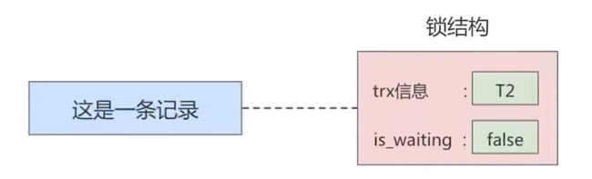

# MySQL_锁
事务的```隔离性```由锁来实现

<br/><br/>
## 1. 概述
在数据库中，除传统的计算资源（如CPU、RAM、I/O）的争用以外，数据也是一种供许多用户共享的资源。为保证数据的一致性，需要对```并发操作进行控制```，
因此产生了锁。同时```锁机制```也为实现mysql的各个隔离级别提供了保证。```锁冲突```也是影响数据库```并发访问性能```的一个重要因素。
所以锁对数据库而言显得尤其重要，也更加复杂。


<br/><br/>
## 2. mysql并发事务访问相同记录
并发事务访问相同记录的情况大致可以划分为三种：
+ 读-读情况 <br>
  ```读-读```情况，即并发事务相继```读取相同的记录```。读取操作本身不会对记录有任何影响，并不会引起什么问题，所以允许这种情况的发生。
  

+ 写-写情况 <br>
  ```写-写```情况，即并发事务相继对相同的记录做出改动。<br>
  这种情况下会发生```脏写```的问题，任何一种隔离级别都不允许这种问题的发生。所以在多个未提交事务相继对一条记录做改动时，需要让它们```排队执行```，
  这个排队的过程其实是通过```锁```来实现的。这个所谓的锁其实是一个```内存中的结构```，在事务执行前本来是没有锁的，也就是说一开始是没有```锁结构```和记录进行关联的，如图所示：<br>
  
  <br>
  当一个事务想对这条记录做改动时，首先会看看内存中有没有与这条记录关联的```锁结构```，当没有的时候就会在内存中生成一个```锁结构```与之关联。
  比如，事务T1要对这条记录做改动，就需要生成一个```锁结构```与之关联：<br>
  
  <br>
  在```锁结构```里有很多信息，为了简化理解，只把两个比较重要的属性拿了出来：<br>
  + ```trx```：代表这个锁结构是哪个事务生成的。
  + ```is_waitting```：代表当前事务是否在等待。<br>
  
  当事务```T1```改动了这条记录后，就生成了一个```锁结构```与该记录关联，因为之前没有别的事务为这条记录加锁，所以```is_waiting```属性就是```false```，
  我们把这个场景就称之为```获取锁成功```，或者```加锁成功```，然后就可以继续执行操作了。<br>
  在事务```T1```提交之前，另一个事务```T2```也想对该记录做改动，那么先看看有没有```锁结构```与这条记录关联，发现有一个```锁结构```与之关联后，
  然后也生成一个锁结构与这条记录关联，不过锁结构的```is_waiting```属性为```true```，表示当前事务需要等待，我们把这个场景就称之为```获取锁失败```，或者```加锁失败```，图示：<br>
  
  <br>
  在事务T1提交之后，就会把该事务生成的```锁结构释放```掉，然后看看还有没有别的事务在等待获取锁，发现了事务T2还在等待获取锁，所以把事务T2对应的锁结构的```is_waiting```属性设置为```false```，
  然后把该事务对应的线程唤醒，让它继续执行，此时事务T2就算获取到了锁。效果图如下：<br>
  
  <br>
  小结几种说法：
  + 不加锁 <br>
    意思就是不需要在内存中生成对应的```锁结构```，可以直接执行操作。
  + 获取锁成功，或者加锁成功 <br>
    意思就是在内存中生成了对应的```锁结构```，而且锁结构的```is_waiting```属性为```false```，也就是事务可以继续执行操作。
  + 获取锁失败，或者加锁失败，或者没有获取到锁 <br>
    意思就是在内存中生成了对应的```锁结构```，不过锁结构的```is_waiting```属性为```true```，也就是事务需要等待，不可以继续执行操作。
    

+ 读-写或写-读情况 <br>
  ```读-写```或```写-读```，即一个事务进行读取操作，另一个事务进行改动操作。这种情况下可能发生```脏读```、```不可重复读```、```幻读```的问题。
  <br>
  各个数据库厂商对```sql标准```的支持都可能不一样。比如mysql在```repeatable read```隔离级别上就已经解决了```幻读```问题。


<br/><br/>
## 3. 并发问题的解决方案
怎么解决```脏读```、```不可重复读```、```幻读```这些问题呢？其实有两种可选的解决方案：<br>
+ 方案一：读操作利用多版本并发控制MVCC，写操作进行加锁。<br>
  所谓```mvcc```，就是生成一个```ReadView```，通过ReadView找到符合条件的记录版本（历史版本由```undo日志```构建）。查询语句只能```读```到在生成ReadView之前```已提交事务所做的更改```，
  在生成ReadView之前未提交的事务或者之后才开启的事务所做的更改是看不到的。而```写操作```肯定针对的是```最新版本的记录```，读记录的历史版本和改动记录的最新版本本身并不冲突，也就是采用MVCC时，读-写操作并不冲突。
  <br>
  ```text
  普通的SELECT语句 在READ COMMITTED和REPEATABLE READ隔离级别下会使用到MVCC读取记录。
  
  • 在READ COMMITTED 隔离级别下，一个事务在执行过程中每次执行SELECT操作时都会生成一个ReadView, 
    ReadView的存在本身就保证了 事务不可以读取到未提交的事务所做的更改，也就是避免了脏读现象；
  
  • 在REPEATABLE READ 隔离级别下，一个事务在执行过程中只有 第一次执行SELECT操作 才会生成一个ReadView， 
    之后的SELECT操作都复用 这个ReadView，这样也就避免了不可重复读和幻读的问题。
  ```
  

+ 方案二：读、写操作都采用加锁的方式 <br>
  如果我们的一些业务场景不允许读取记录的旧版本，而是每次都心须去```读取记录的最新版本```。比如，在银行存款的事务中，你需要先把账户的余额读出来，然后将其加上本次存款的数额，最后再写到数据库中。
  在将账户余额读取出来后，就不想让别的事务再访问该余额，直到本次存款事务执行完成，其他事务才可以访问账户的余额。
  这样在读取记录的时候就需要对其进行```加锁```操作，这样也就意味着```读```操作和```写```操作也像```写-写```操作那样```排队```执行。
  <br>
  <br>
  ```脏读```的产生是因为当前事务读取了另一个未提交事务写的一条记录，如果另一个事务在写记录的时候就给这条记录加锁，
  那么当前事务就无法继续读取该记录了，所以也就不会有脏读问题的产生了。
  <br>
  <br>
  ```不可重复读```的产生是因为当前事务先读取一条记录，另外一个事务对该记录做了改动之后并提交之后，当前事务再次读取时会获得不同的值，
  如果在当前事务读取记录时就给该记录加锁，那么另一个事务就无法修改该记录，自然也不会发生不可重复读了。
  <br>
  <br>
  ```幻读```问题的产生是因为当前事务读取了—个范围的记录，然后另外的事务向该范围内插入了新记录，
  当前事务再次读取该范围的记录时发现了新插入的新记录。采用加锁的方式解决幻读问题就有一些麻烦，因为当前事务在第一次读取记录时幻影记录并不存在，
  所以读取的时候加锁就有点尴尬（因为你并不知道给谁加锁）
  <br>
  <br>
  + 小结：
    + 采用```MVCC```方式的话，```读-写```操作彼此并不冲突，```性能更高```。
    + 采用```加锁```方式的话，```读-写```操作彼此需要```排队执行```，影响性能。
      <br>
      <br>
      一般情况下我们当然愿意采用```MVCC```来解决```读-写```操作并发执行的问题，但是业务在某些特殊情况下，要求必须采用```加锁```的方式执行。
 


