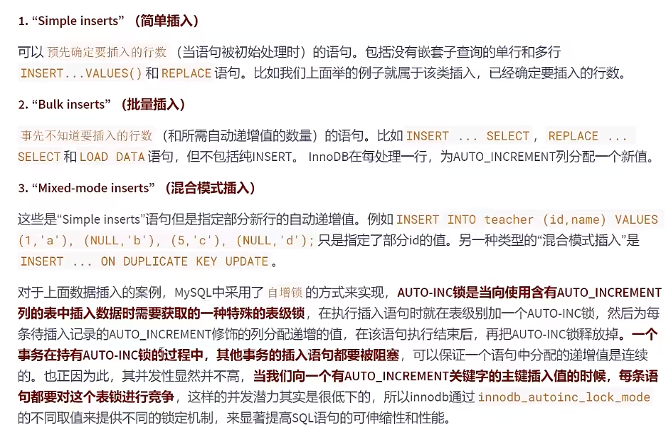
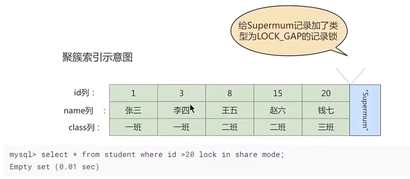
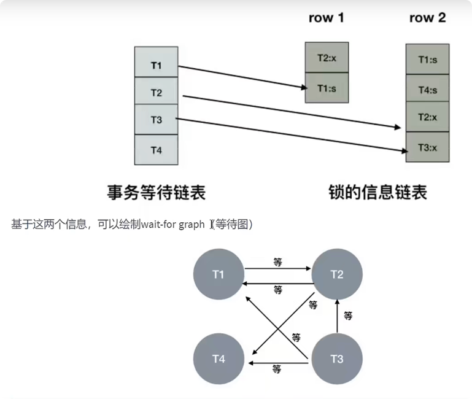
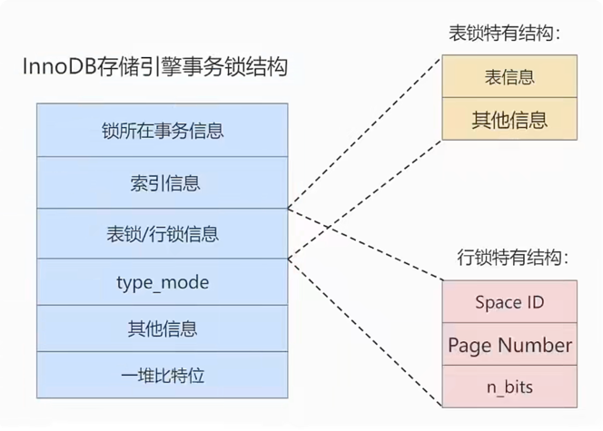
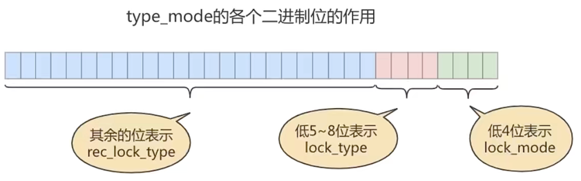

# MySQL_锁
事务的```隔离性```由锁来实现

<br/><br/>
## 1. 概述
在数据库中，除传统的计算资源（如CPU、RAM、I/O）的争用以外，数据也是一种供许多用户共享的资源。为保证数据的一致性，需要对```并发操作进行控制```，
因此产生了锁。同时```锁机制```也为实现mysql的各个隔离级别提供了保证。```锁冲突```也是影响数据库```并发访问性能```的一个重要因素。
所以锁对数据库而言显得尤其重要，也更加复杂。


<br/><br/>
## 2. mysql并发事务访问相同记录
并发事务访问相同记录的情况大致可以划分为三种：
+ 读-读情况 <br>
  ```读-读```情况，即并发事务相继```读取相同的记录```。读取操作本身不会对记录有任何影响，并不会引起什么问题，所以允许这种情况的发生。
  

+ 写-写情况 <br>
  ```写-写```情况，即并发事务相继对相同的记录做出改动。<br>
  这种情况下会发生```脏写```的问题，任何一种隔离级别都不允许这种问题的发生。所以在多个未提交事务相继对一条记录做改动时，需要让它们```排队执行```，
  这个排队的过程其实是通过```锁```来实现的。这个所谓的锁其实是一个```内存中的结构```，在事务执行前本来是没有锁的，也就是说一开始是没有```锁结构```和记录进行关联的，如图所示：<br>
  
  <br>
  当一个事务想对这条记录做改动时，首先会看看内存中有没有与这条记录关联的```锁结构```，当没有的时候就会在内存中生成一个```锁结构```与之关联。
  比如，事务T1要对这条记录做改动，就需要生成一个```锁结构```与之关联：<br>
  
  <br>
  在```锁结构```里有很多信息，为了简化理解，只把两个比较重要的属性拿了出来：<br>
  + ```trx```：代表这个锁结构是哪个事务生成的。
  + ```is_waitting```：代表当前事务是否在等待。<br>
  
  当事务```T1```改动了这条记录后，就生成了一个```锁结构```与该记录关联，因为之前没有别的事务为这条记录加锁，所以```is_waiting```属性就是```false```，
  我们把这个场景就称之为```获取锁成功```，或者```加锁成功```，然后就可以继续执行操作了。<br>
  在事务```T1```提交之前，另一个事务```T2```也想对该记录做改动，那么先看看有没有```锁结构```与这条记录关联，发现有一个```锁结构```与之关联后，
  然后也生成一个锁结构与这条记录关联，不过锁结构的```is_waiting```属性为```true```，表示当前事务需要等待，我们把这个场景就称之为```获取锁失败```，或者```加锁失败```，图示：<br>
  
  <br>
  在事务T1提交之后，就会把该事务生成的```锁结构释放```掉，然后看看还有没有别的事务在等待获取锁，发现了事务T2还在等待获取锁，所以把事务T2对应的锁结构的```is_waiting```属性设置为```false```，
  然后把该事务对应的线程唤醒，让它继续执行，此时事务T2就算获取到了锁。效果图如下：<br>
  
  <br>
  小结几种说法：
  + 不加锁 <br>
    意思就是不需要在内存中生成对应的```锁结构```，可以直接执行操作。
  + 获取锁成功，或者加锁成功 <br>
    意思就是在内存中生成了对应的```锁结构```，而且锁结构的```is_waiting```属性为```false```，也就是事务可以继续执行操作。
  + 获取锁失败，或者加锁失败，或者没有获取到锁 <br>
    意思就是在内存中生成了对应的```锁结构```，不过锁结构的```is_waiting```属性为```true```，也就是事务需要等待，不可以继续执行操作。
    

+ 读-写或写-读情况 <br>
  ```读-写```或```写-读```，即一个事务进行读取操作，另一个事务进行改动操作。这种情况下可能发生```脏读```、```不可重复读```、```幻读```的问题。
  <br>
  各个数据库厂商对```sql标准```的支持都可能不一样。比如mysql在```repeatable read```隔离级别上就已经解决了```幻读```问题。


<br/><br/>
## 3. 并发问题的解决方案
怎么解决```脏读```、```不可重复读```、```幻读```这些问题呢？其实有两种可选的解决方案：<br>
+ 方案一：读操作利用多版本并发控制MVCC，写操作进行加锁。<br>
  所谓```mvcc```，就是生成一个```ReadView```，通过ReadView找到符合条件的记录版本（历史版本由```undo日志```构建）。查询语句只能```读```到在生成ReadView之前```已提交事务所做的更改```，
  在生成ReadView之前未提交的事务或者之后才开启的事务所做的更改是看不到的。而```写操作```肯定针对的是```最新版本的记录```，读记录的历史版本和改动记录的最新版本本身并不冲突，也就是采用MVCC时，读-写操作并不冲突。
  <br>
  ```text
  普通的SELECT语句 在READ COMMITTED和REPEATABLE READ隔离级别下会使用到MVCC读取记录。
  
  • 在READ COMMITTED 隔离级别下，一个事务在执行过程中每次执行SELECT操作时都会生成一个ReadView, 
    ReadView的存在本身就保证了 事务不可以读取到未提交的事务所做的更改，也就是避免了脏读现象；
  
  • 在REPEATABLE READ 隔离级别下，一个事务在执行过程中只有 第一次执行SELECT操作 才会生成一个ReadView， 
    之后的SELECT操作都复用 这个ReadView，这样也就避免了不可重复读和幻读的问题。
  ```
  

+ 方案二：读、写操作都采用加锁的方式 <br>
  如果我们的一些业务场景不允许读取记录的旧版本，而是每次都心须去```读取记录的最新版本```。比如，在银行存款的事务中，你需要先把账户的余额读出来，然后将其加上本次存款的数额，最后再写到数据库中。
  在将账户余额读取出来后，就不想让别的事务再访问该余额，直到本次存款事务执行完成，其他事务才可以访问账户的余额。
  这样在读取记录的时候就需要对其进行```加锁```操作，这样也就意味着```读```操作和```写```操作也像```写-写```操作那样```排队```执行。
  <br>
  <br>
  ```脏读```的产生是因为当前事务读取了另一个未提交事务写的一条记录，如果另一个事务在写记录的时候就给这条记录加锁，
  那么当前事务就无法继续读取该记录了，所以也就不会有脏读问题的产生了。
  <br>
  <br>
  ```不可重复读```的产生是因为当前事务先读取一条记录，另外一个事务对该记录做了改动之后并提交之后，当前事务再次读取时会获得不同的值，
  如果在当前事务读取记录时就给该记录加锁，那么另一个事务就无法修改该记录，自然也不会发生不可重复读了。
  <br>
  <br>
  ```幻读```问题的产生是因为当前事务读取了—个范围的记录，然后另外的事务向该范围内插入了新记录，
  当前事务再次读取该范围的记录时发现了新插入的新记录。采用加锁的方式解决幻读问题就有一些麻烦，因为当前事务在第一次读取记录时幻影记录并不存在，
  所以读取的时候加锁就有点尴尬（因为你并不知道给谁加锁）
  <br>
  <br>
  + 小结：
    + 采用```MVCC```方式的话，```读-写```操作彼此并不冲突，```性能更高```。
    + 采用```加锁```方式的话，```读-写```操作彼此需要```排队执行```，影响性能。
      <br>
      <br>
      一般情况下我们当然愿意采用```MVCC```来解决```读-写```操作并发执行的问题，但是业务在某些特殊情况下，要求必须采用```加锁```的方式执行。


<br/><br/>
## 4. 锁
## 4.1  从数据操作的类型划分：读锁、写锁
对于数据库中并发事务的```读-读```情况并不会引起什么问题。对于```写-写```、```读-写```或```写-读```这些情况可能会引起一些问题，
需要使用```MVCC```或者```加锁```的方式来解决它们。在使用```加锁```的方式解决问题时，由于既要允许```读-读```情况不受影响，
又要使```写-写```、```读-写```或```写-读```情况中的操作```相互阻塞```，所以MysQL实现一个由两种类型的锁组成的锁系统来解决。
这两种类型的锁通常被称为 共享锁 (Shared Lock, SLock）和 排他锁 (Exclusive Lock. x Lock). 也叫 读锁 (read lock）和写锁 (write lock)
+ 读锁：也称为 共享锁、英文用 S 表示。针对同一份数据，多个事务的读操作可以同时进行而不会互相影响，相互不阻塞的。

+ 写锁：也称为 排他锁、英文用 X 表示。当前写操作没有完成前，它会阻断其他写锁和读锁。这样就能确保在给定的时间里，只有一个事务能执行写入，并防止其他用户读取正在写入的同一资源。

**需要注意的是对于 InnoDB 引擎来说，读锁和写锁可以加在表上，也可以加在行上。**
<br>
**举例（行级读写锁）**：如果一个事务 T1 已经获得了某个行r的读锁，那么此时另外的一个事务 T2 是可以去获得这个行r的读锁的，
因为读取操作并没有改变行的数据; 但是，如果某个事务 T3 想获得行r的写锁，则它必须等待事务 T1、T2 释放掉行r上的读锁才行。
<br>

|  | X锁  | S锁 |
| :------:| :------: | :---:|
| X锁 | 不兼容 | 不兼容|
| S锁 | 不兼容 | 兼 容 |
<br>

### 1. 锁定读
在采用```加锁```方式解决```脏读```、```不可重复读```、```幻读```这些问题时，读取一条记录时需要获取该记录的```S锁```，其实是不严谨的，
有时候需要在读取记录时就获取记录的```X锁``` ，来禁止别的事务读写该记录，为此MysQL提出了两种比较特殊的 SELECT 语句格式：
+ 对读取的记录加```S锁```：
  ```mysql
  select ... lock in share mode ;
  #或
  select ... for share ; #(8.0新增语法)
  ```
  在普通的```SELECT```语向后边加```LOCK IN SHARE MODE```，如果当前事务执行了该语句，那么它会为读取到的记录加```S锁```，这样允许别的事务继续获取这些记录的```S锁``` 
  （ 比方说别的事务也使用```SELECT ... LOCK IN SHARE MODE``` 语向来读取这些记录），但是不能获取这些记录的```X锁```（比如使用```SELECT ... FOR UPDATE``` 语句来读取这些记录，或者直接修改这些记录）。
  如果别的事务想要获取这些记录的```X锁```，那么它们会阻塞，直到当前事务提交之后将这些记录上的```S锁```释放掉。
  

+ 对读取的记录加X锁：<br>
  ```mysql
  select ... for update; 
  ```
  在普通的```SELECT```语句后边加```FOR UPDATE```，如果当前事务执行了该语句，那么它会为读取到的记录加```X锁```，
  这样既不允许别的事务获取这些记录的```S锁```（比方说别的事务使用```SELECT ... LOCK IN SHARE MODE``` 语句来读取这些记录），
  也不允许获取这些记录的```X锁```（比如使用 ```SELECT ... FOR UPDATE``` 语句来读取这些记录，或者直接修改这些记录）。
  如果别的事务想要获取这些记录的```S锁```或者```X锁```，那么它们会阻塞，直到当前事务提交之后将这些记录上的```X锁```释放掉。 

<br>

### 2. 写操作
平常所用到的```写操作```无非是```DELETE```、```UPDATE```、 ```INSERT```这三种：
+ ```DELETE```: <br>
  对一条记录做```DELETE```操作的过程其实是先在```B+```树中定位到这条记录的位置，然后获取这条记录的```X锁```，再执行```delete mark```操作。
  我们也可以把这个定位待删除记录在B+树中位置的过程看成是一个获取```X锁```的锁定读。
+ ```UPDATE```：在对一条记录做UPDATE操作时分为三种情况：
  + 情況1：未修改该记录的键值，并且被更新的列占用的存储空间在修改前后末发生变化。
    则先在```B+```树中定位到这条记录的位置，然后再获取一下记录的```X锁```，最后在原记录的位置进行修改操作。
    我们也可以把这个定位待修改记录在```B+```树中位置的过程看成是一个获取```X锁```的```锁定读```。
  + 情况2：未修改该记录的键值，并且至少有一个被更新的列占用的存储空间在修改前后发生变化。
    则先在```B+```树中定位到这条记录的位置，然后获取一下记录的```X锁```，将该记录彻底删除掉（就是把记录彻底移入垃圾链表），最后再插入一条新记录。
    这个定位待修改记录在B+树中位置的过程看成是一个获取```X锁```的```锁定读```，新插入的记录由```INSERT```操作提供的```隐式锁```进行保护。
  + 情况3：修改了该记录的键值，则相当于在原记录上做```DELETE```操作之后再来一次```INSERT```操作，加锁操作就需要按照```DELETE```和```INSERT```的规则进行了。
  
+ ```INSERT```: <br>
  一般情况下，新插入一条记录的操作并不加锁，通过一种称之为```隐式锁```的结构来保护这条新插入的记录在本事务提交前不被别的事务访问。


<br>
<br>
<br>

## 4.2 从数据操作的粒度划分：表级锁、页级锁、行锁 ——之表锁
为了尽可能提高数据库的并发度，每次锁定的数据范围越小越好，理论上每次只锁定当前操作的数据的方案会得到最大的并发度，但是管理锁是```耗资源```的事情（涉及获取、检查、释放锁等动作）。
因此数据库系统需要在```高并发响应```和```系统性能```两方面进行平衡，这样就产生了```“锁粒度（lock granularity）”```的概念。

对一条记录加锁影响的也只是这条记录，我们就说这个锁的粒度比较细；其实一个事务也可以在```表级别```进行加锁，自然就被称之为```表级锁```或者```表锁```，
对一个表加锁影响整个表中的记录，我们就说这个锁的粒度比较粗。锁的粒度主要分为表级锁、页级锁和行锁

<br>

### 1. 表锁（table lock）
该锁会锁定整张表，它是mysql中最基本的锁策略，并```不依赖于存储引擎```（不管你是mysql的什么存储引擎，对于表锁的策略都是一样的），并且表锁是```开销最小```的策略（因为粒度比较大）。
由于表级锁一次会将整个表锁定，所以可以很好的```避免死锁```问题。当然，锁的粒度大所带来最大的负面影响就是出现锁资源争用的概率也会最高，导致```并发率大打折扣```。


+ 在对某个表执行select、insert、delete、update语句时，innodb存储引擎是不会为这个表添加表级别的```S锁```或者```X锁```的。
在对某个表执行一些诸如```alter table```、```drop table```这类的```DDL```语句时，其他事务对这个表并发执行诸如select、insert、delete、update的语句会发生阻塞。
同理，某个事务中对某个表执行select、insert、delete、update语句时，在其他会话中对这个表执行```DDL```语句也会发生阻塞。
这个过程其实是通过在```server层```使用一种称之为```元数据锁```（英文名：```metadata locks```，简称```MDL```）结构来实现的。


+ 一般情况下，不会使用innodb存储引擎提供的表级别```S锁```和```X锁```。只会在一些特殊情况下，比方说```崩溃恢复```过程中用到。比如，在系统变量```autocommit=0```，```innodb_table_locks=1```时，
```手动```获取innodb存储引擎提供的```表级别```的```S锁```或者```X锁```可以这么写：
  + ```lock tables t read```：innodb存储引擎会对表```t```加表级别的```S锁```。
  
  + ```lock tables t write```：innodb存储引擎会对表```t```加表级别的```X锁```。
     
+ 不过尽量避免在使用innodb存储引擎的表上使用```lock tables```这样的手动锁表语句，它们并不会提供什么额外的保护，只是会降低并发能力而已。
     innodb的厉害之处还是实现了更细粒度的```行锁```。

+ 总结 <br>
MyISAM在执行查询语句（select）前，会给涉及的所有表加读锁，在执行增删改操作前，会给涉及的表加写锁。
```innodb```存储引擎是不会为这个表添加```表级别```的```读锁```或者```写锁```的。
<br>
<br>
MySQL的表级锁有两种模式： <br>

  + 表共享读锁（table read lock）
  
  + 表独占写锁（table write lock）
  
  | 锁类型 | 自己可读  | 自己可写 | 自己可操作其他表 | 他人可读  | 他人可写 |  
  | :------:| :------: | :---:    | :---:           |:---:      |:---:   |
  | 读锁   |   是    |    否     |      否         |     是    |  否，等 | 
  | 写锁   |   是    |    是     |      否         |    否，等  |  否，等 | 
  

<br>

### 2. 意向锁(表锁)（intention lock）
+ innodb支持```多粒度锁（multiple granularity locking）```，它允许```行级锁```与```表级锁```共存，而```意向锁```就是其中的一种```表锁```。 
  1. 意向锁的存在是为了协调行锁和表锁的关系，支持多粒度（表锁与行锁）的锁共存。
  
  2. 意向锁是一种```不与行级锁冲突的表级锁```，这一点非常重要。
  3. 表明“某个事务正在某些行持有了锁或该事务准备去持有锁”
  
<br>
  
+ 意向锁分为两种： <br>

  + **意向共享锁**（intention shared lock，IS）：事务有意向对表中的某些行加**共享锁**（S锁）
     ```mysql
     # 事务要获取某些行的S锁，必须先获得表的IS锁。
  
     select cloumn from table_name ... lock in share mode ;
     ```
      
  + **意向排他锁**（intention exclusive lock，IX）：事务有意向对表中的某些行加**排他锁**（X锁） 
     ```mysql
     # 事务要获取某些行的X锁，必须先获得表的IX锁。
  
     select cloumn from table_name ... for update ;
     ```
         
  即：意向锁是由存储引擎```自己维护的```， 用户无法手动操作意向锁，在为数据行加共享/排他锁之前，InnoDB会先获取该数据行```所在数据表的对应意向锁```。
  <br>

<br>
      
+ **意向锁要解决的问题**
  <br>
  
  现在有两个事务，分别是T1和T2，其中T2试图在该表级别上应用共享或排它锁，如果没有意向锁存在，那么T2就
  需要去检查各个页或行是否存在锁；如果存在意向锁，那么此时就会受到由T1控制的 ```表级别意向锁的阻塞```。T2在
  锁定该表前不必检查各个页或行锁，而只需检查表上的意向锁。简单来说就是给更大一级别的空间示意里面是否已经上过锁。
  <br>
      
  在数据表的场景中，**如果我们给某一行数据加上了排它锁，数据库会自动给更大一级的空间，比如数据页或数据
  表加上意向锁，告诉其他人这个数据页或数据表已经有人上过排它锁了**，这样当其他人想要获取数据表排它锁的
  时候，只需要了解是否有人已经获取了这个数据表的意向排他锁即可。
  + 如果事务想要获数据表中某些记录的共享锁, 就需要在数据表上```添加意向共享锁```。
  
  + 如果事务想要获得数据表中某些记录的排他锁，就需要在数据表上```添加意向排他锁```。
  <br>
  这时，意向锁会告诉其他事务已经有人锁定了表中的某些记录。

<br>

+ 意向锁的兼容情况（以下都针对表级锁） <br>

  |                 | 意向共享锁（IS）  | 意向排他锁（IX）|
  | :------         | :------:          |     :---:     |
  | 意向共享锁（IS） |  兼 容           |  兼 容         |
  | 意向排他锁（IX） |  兼 容           | 兼 容          |

   <br>

   |                 | 意向共享锁（IS）  | 意向排他锁（IX）|
   | :------         | :------:          |     :---:     |
   |    共享锁（S）   |  兼 容           |  互 斥         |
   |    排他锁（X）   |  互 斥           | 互 斥          |


<br>

### 3. 自增锁(表锁)（auto-inc锁）



<br>

### 4. 元数据锁(表锁)（MDL锁）
MySQL5.5引入了meta data lock，简称MDL锁，属于表锁范畴。MDL 的作用是，保证读写的正确性。比如，如果一
个查询正在遍历一个表中的数据，而执行期间另一个线程对这个```表结构做变更```，增加了一列，那么查询线程拿到
的结果跟表结构对不上，肯定是不行的。

因此，**当对一个表做增删改查操作的时候，加 MDL读锁；当要对表做结构变更操作的时候，加 MDL 写锁**。

读锁之间不互斥，因此你可以有多个线程同时对一张表增删改查。读写锁之间、写锁之间是互斥的，用来保证变
更表结构操作的安全性，解决了DML和DDL操作之间的一致性问题。```不需要显式使用```，在访问一个表的时候会被自动加上。


<br>
<br>
<br>

## 4.2 从数据操作的粒度划分：表级锁、页级锁、行锁 ——之innodb行锁
行锁 (Row Lock） 也称为记录锁，顾名思义，就是锁住某一行（某条记录 row）。需要的注意的是，MySQL 服务器层并没有实现行锁机制，**行级锁只在存储引擎层实现**。
<br>
**优点**：锁定力度小，发生**锁冲突概率低**，可以实现的**并发度高**。
<br>
**缺点**：对于**锁的开销比较大**，加锁会比较慢，容易出现**死锁**情况。
<br>
InnoDB与MyISAM的最大不同有两点：<br>
+ 一是支持事务 (TRANSACTION)；


+ 二是采用了行级锁。

### 1. 记录锁（record locks）
记录锁也就是仅仅把一条记录锁上，官方的类型名称为： ```LOCK_REC_NOT_GAP```。比如我们把id值为8的那条记录加一个记录锁的示意图如图所示。
仅仅是锁住了id值为8的记录，对周围的数据没有影响。<br>

<br>
记录锁是有S锁和X锁之分的，称之为```S型记录锁```和```X型记录锁```。
+ 当一个事务获取了一条记录的S型记录锁后，其他事务也可以继续获取该记录的S型记录锁，但不可以继续获取X型记录锁;
  

+ 当一个事务获取了一条记录的X型记录锁后，其他事务既不可以继续获取该记录的S型记录锁，也不可以继续获取X型记录锁.


### 2. 间隙锁（gap locks）
```MySQL``` 在 ```REPEATABLE READ``` 隔离级别下是可以解决幻读问题的，解决方案有两种，可以使用 ```MVCC``` 方案解决，
也可以采用 ```加锁``` 方案解决。但是在使用加锁方案解决时有个大问题，就是事务在第一次执行读取操作时，那些幻影记录尚不存在，我们无法给这些```幻影记录```加上 ```记录锁```。InnoDB提出了一种称之为 ```Gap Locks``` 的锁，
官方的类型名称为：```LOCK_GAP```，我们可以简称为```gap锁```。比如，把id值为8的那条记录加一个gap锁的示意图如下. <br>

<br>
图中id值为8的记录加了gap锁，意味着````不允许别的事务在id值为8的记录前边的间隙插入新记录````，其实就是id列的值（3,8)这个区间的新记录是不允许立即插入的。
比如，有另外一个事务再想插入一条id值为4的新记录，它定位到该条新记录的下一条记录的id值为8，而这条记录上又有一个gap锁，所以就会阳塞插入操作，直到拥有这个gap锁的
事务提交了之后，id列的值在区间(3,8)中的新记录才可以被插入。<br>

**gap锁的提出仅仅是为了防止插入幻影记录而提出的**。虽然有```共享gap锁```和```独占gap锁```这样的说法，但是它们起到的作用是相同的。
而且如果对一条记录加了gap锁（不论是共享gap锁还是独占gap锁），并不会限制其他事务对这条记录加记录锁或者继续加gap锁. <br>

**举例：** <br>

<br>
这里 session 2 并不会被堵住。因为表里并没有 id=5 这个记录，因此 session 1 加的是间隙锁（3,8)。
而 session 2 也是在这个间際加的间隙锁。它们有共同的目标，即：保护这个间隙，不允许插入值。但，它们之间是不冲突的。
<br>

注意，给一条记录加了```gap锁```只是```不允许```其他事务往这条记录前边的间隙插人新记录，那对于最后—条记录之后的间隙，也就是student表中id值为 20 的记录之后的间隙该咋办呢？
也就是说给哪条记录加```gap锁```才能阻止其他事务插入```id```值在```（20，+∞）```这个区间的新记录呢？
这时候我们在讲数据页时介绍的两条伪记录派上用场了：<br>
+ Infimum 记录，表示该页面中最小的记录。
  

+ Supremum 记录，表示该页面中最大的记录。<br>

为了实现阻止其他事务插入```id```值在```(20,+∞)```这个区间的新记录，我们可以给索引中的最后一条记录，也就是id值为20的那条记录所在页面的Supremum记录加上—个gap锁，如图所示。 <br>

<br>


### 3. 临键锁（next-key locks）
有时候我们既想```锁住某条记录```，又想```阻止```其他事务在该记录前边的 ```间隙插入新记录```，所以innoDB就提出了一种称之为 ```Next-Key Locks``` 的锁，
官方的类型名称为：```LOCK_ORDINARY```，我们也可以简称为```next-key锁```。
Next-Key Locks是在存储引擎 ```innodb```、事务级别在 ```可重复读``` 的情况下使用的数据库锁，innodb默认的锁就是Next-key locks。 
比如，我们把id值为8的那条记录加一个next-key锁的示意图如下：<br>

<br>
```next-key锁``` 的本质就是一个```记录锁```和一个```gap锁```的合体，它既能保护该条记录，又能阻止别的事务将新记录插入被保护记录前边的```间隙```。
```mysql
begin ;

select * from student where id <= 8 and id > 3 for update ;
```


### 4. 插入意向锁（insert intention locks）
我们说一个事务在```插入```一条记录时需要判断一下插入位置是不是被别的事务加了```gap锁```（```next-key锁``` 也包含```gap锁```），如果有的话，插入操作需要等待，直到拥有```gap锁``` 的那个事务提交。
但是**InnoDB规定事务在等待的时候也需要在内存中生成一个锁结构**，表明有事务想在某个```间隙```中```插入```新记录，但是现在在等待。
InnoDB就把这种类型的锁命名为```Insert Intention Locks```，官方的类型名称为：```LOCK_INSERT_INTENTION```，我们称为```插入意向锁```。
插入意向锁是一种 ```Gap锁```，不是意向锁，在insert操作时产生。 <br>

插入意向锁是在插入一条记录行前，由```INSERT 操作产生的一种间隙锁```。该锁用以表示插入意向，当多个事务在同一区间 (gap）插入位置不同的多条数据时，事务之间不需要互相等待。
假设存在两条值分别为 4 和 7 的记录，两个不同的事务分别试图插入值为 5 和 6的两条记录，每个事务在获取插入行上独占的（排他）锁前，都会获取（4， 7）之间的间隙锁，
但是因为数据行之间并```不冲突```，所以两个事务之间并不会产生冲突（阻塞等待）。
<br>
总结来说，插入意向锁的特性可以分成两部分：<br>
+  插入意向锁是一种```特殊的间隙锁``` ——间隙锁可以锁定开区间内的部分记录。


+  插入意向锁之间 ```互不排斥```，所以即使多个事务在同一区间插入多条记录，只要记录本身（主键、唯一索引）不冲突，那么事务之间就不会出现冲突等待。

注意，虽然插入意向锁中含有意向锁三个字，但是它并不属于意向锁而属于问隙锁，因为意向锁是表锁而插入意向锁是```行锁```. <br>

比如，把id值为8的那条记录加一个插入意向锁的示意图如下： <br>

<br>
比如，现在T1为id值为8的记录加了一个gap锁，然后T2和T3分别想向student表中插入id值分别为4、5的两条记录，所以现在为id值为8的记录加的锁的示意图就如下所示：<br>

<br>
从图中可以看到，由于T1持有gap锁，所以T2和T3需要生成一个插入意向锁的锁结构并日处于等待状态。
当T1提交后会把它获取到的锁都释放掉，这样T2和T3就能获取到对应的插入意向锁了（本质上就是把插入意向锁对应锁结构的is_waiting厲性改为false），T2和T3之间也并不会相互阻塞，
它们可以同时获取到id值为8的插入意向锁，然后执行插入操作。事实上**插入意向锁并不会阻止别的事务继续获取该记录上任何类型的锁**。


<br>
<br>
<br>

## 4.2 从数据操作的粒度划分：表级锁、页级锁、行锁 ——之页锁
页锁就是在```页的粒度```上进行锁定，锁定的数据资源比行锁要多，因为一个页中可以有多个行记录。当我们使用页锁的时候，会出现数据浪费的现象，但这样的浪费最多也就是一个页上的数据行。
**页锁的开销介于表锁和行锁之间，会出现死锁。锁定粒度介于表锁和行锁之间，并发度一般.**

每个层级的锁数量是有限制的，因为锁会占用内存空间，```锁空间的大小是有限的```。当某个层级的锁数量超过了这个层级的阈值时，就会进行```锁升级```。
锁升级就是用更大粒度的锁替代多个更小粒度的锁，比如 InnoDB 中行锁升级为表锁，这样做的好处是占用的锁空间降低了，但同时数据的并发度也下降了。


<br>
<br>
<br>

## 4.3 从对待锁的态度划分：乐观锁、悲观锁
从对待锁的态度来看锁的话，可以将锁分成乐观锁和悲观锁，从名字中也可以看出这两种锁是两种看待```数据并发的思维方式```。需要注意的是，乐观锁和悲观锁并不是锁，而是锁的```设计思想```。

### 1. 悲观锁（pessimistic locking）
悲观锁是一种思想，顾名思义，就是很悲观，对数据被其他事务的修改持保守态度，会通过对数据库自身的锁机制来实现，从而保证数据操作的排他性。

悲观锁总是假设最坏的情况，每次去拿数据的时候都认为别人会修改，所以每次在拿数据的时候都会上锁，这样别人想拿这个数据就会```阻塞```直到它拿到锁（**共享资源每次只给一个线程使用，其它线程阻塞，用完后再把资源转让给其它线程**）。
比如行锁，表锁等，读锁，写锁等，都是在做操作之前先上锁，当其他线程想要访问数据时，都需要阻塞挂起。Java中 ```synchronized```和```ReentrantLock```等独占锁就是悲观锁思想的实现.

**秒杀案例1：** <br>
商品秒杀过程中，库存数量的减少，避免出现```超卖```的情况。比如，商品表中有一个字段为quantity表示当前该商品的库存量。
假设商品为华为mate40，id为1001，quantity=100个。如果不使用锁的情况下，操作方法如下所示
```mysql
# 第1步：查出商品库存
select quantity from items where id = 1001;

# 第2步：如果库存大于0，则根据南品信息生产订单
insert into orders (item_id) values(1001) ;

# 第3步：修改商品的库存，num表示购买数量
update items set quantity = quantity - num where id = 1001;
```
这样写的话，在并发量小的公司没有大的问题 但是如果在 高并发环境 下可能出现以下问题 <br>

|     |        线程A          |      线程B            |
|:---:|       :---:          |      :---:           |
| 1  |step1（查询还有100部手机）|step1（查询还有100部手机）|
| 2  |                       |    step2（生成订单）   |
| 3  |       step2（生成订单） |                      |
| 4  |                       |    step3（减库存1）    |
| 5  |     step3（减库存1）    |                      |

其中线程B此时己经下单并且减完库存，这个时候线程A依然去执行step3，就造成了超卖。

我们使用悲观锁可以解决这个问题，商品信息从查询出来到修改，中间有一个生成订单的过程，使用悲观锁的原理就是，当我们在查询items信息后就把当前的数据锁定，
直到我们修改完牛后再解锁。那么整个过程中，因为数据被锁定了，就不会出现有第三者来对其进行修改了。
而这样做的前提是**需要将要执行的SQL语句放在同一个事务中，否则达不到锁定数据行的目的**。<br>

**修改如下：**
```mysql
# 第1步：查出商品库存
select quantity from items where id = 1001 for update;

# 第2步：如果库存大于0，则根据商品信息生产订单
insert into orders (item_id) values(1001);

# 第3步：修改商品的库存，num表示购买数量
update items set quantity = quantity - num where id = 1001;
```
```select ... for update``` 是MySQL中悲观锁。此时在items表中，id为1001的那条数据就被我们锁定了，其他的要执行select quantity from items where id =1001 for update;
语句的事务必须等本次事务提交之后才能执行。这样我们可以保证当前的数据不会被其它事务修改。

注意，当执行select quantity from items where id =1001 for update; 语句之后，如果在其他事务中执行select
quantity from items where id =1001;语向，并不会受第一个事务的影响，仍然可以正常查询出数据。

注意：**select...for update语句执行过程中所有扫描的行都会被锁上，因此在MySQL中用悲观锁必须确定使用了索引，而不是全表扫描，否则将会把整个表锁住**。

悲观锁不适用的场景较多，它存任一些不足，因为悲观锁大多数情况下依靠数据库的锁机制来实现、以保证程序的并发访问性，同时这样对数据库性能开销影响也很大，
特别是```长事务```而言，这样的```开销往往无法承受```，这时就需要乐观锁


### 2. 乐观锁（optimistic locking）
乐观锁认为对同一数据的并发操作不会总发生，属于小概率事件，不用每次都对数据上锁，但是在更新的时候会判断一下在此期间别人有没有去更新这个数据，也就是不采用数据库自身的锁机制，而是通过程序来实现。
在程序上，我们可以采用 ```版本号机制``` 或者 ```CAS机制``` 实现。乐观锁适用于多读的应用类型，这样可以提高吞吐量。
在 Java中 ```java.util.concurrent.atomic``` 包下的原子变量类就是使用了乐观锁的一种实现方式：CAS实现的。

+ **乐观锁的版本号机制** <br>
  在表中设计一个```版本字段 version```，第一次读的时候，会获取 version 字段的取值。然后对数据进行更新或删除操作时，
  会执行 ```UPDATE ... SET version = version + 1 WHERE version = version```。
  此时如果已经有事务对这条数据进行了更改，修改就不会成功。
  <br>
  <br>
  这种方式类似我们熟悉的 SVN、CVS 版本管理系统，当我们修改了代码进行提交时，首先会检查当前版本号与服务器上的版本号是否一致，如果一致就可以直接提交，
  如果不一致就需要更新服务器上的最新代码，然后再进行提交. 
  

+ **乐观锁的时间戳机制** <br>
  时间戳和版本号机制一样，也是在更新提交的时候，将当前数据的时间戳和更新之前取得的时间戳进行比较，如果两者一致则更新成功，否则就是版本冲突。
  <br>
  <br>
  你能看到乐观锁就是程序员自己控制数据并发操作的权限，基本是通过给数据行增加一个戳（版本号或者时间戳），从而证明当前拿到的数据是否最新。


**秒杀案例2** <br>
依然使用上面秒杀的案例，执行流程如下
```mysql
# 第1步：查出商品库存
select quantity from items where id = 1001;

# 第2步：如果库存大于0，则根据商品信息生产订单
insert into orders (item_id) values (1001) ;

# 第3步：修改商品的库存，num表示购买数量
update items set quantity = quantity - num, version = version + 1 
where id = 1001 and version = #{version};
```
注意，如果数据表是```读写分离```的表，当master表中写入的数据没有及时同步到slave表中时，会造成更新一直失败的问题。
此时需要```强制读取master表```中的数据（即将select语句放到事务中即可，这时候查询的就是master主库了。）

如果我们对同一条数据进行```频繁的修改```的话，那么就会出现这么一种场景，每次修改都只有一个事务能更新成功，在业务感知上面就有大量的失败操作。
我们把代码修改如下：
```mysql
# 第1步：查出商品库存
select quantity from items where id = 1001;

# 第2步：如果库存大于0，则根据南品信息生产订单
insert into orders (item_id) values(1001) ;

# 第3步：修改商品的库存，num表示购买数量
update items set quantity = quantity - num where id = 1001 and quantity - num > 0；
```
这样就会使每次修改都能成功，而且不会出现超卖的现象。


### 3. 两种锁的适用情况
+ ```乐观锁``` 适合 ```读操作多``` 的场景，相对来说写的操作比较少。它的优点在于 ```程序实现``` ，```不存在死锁``` 问题，不过适用场景也会相对乐观，因为它阻止不了除了程序以外的数据库操作。
+ ```悲观锁``` 适合 ```写操作多``` 的场景，因为写的操作具有 ```排它性```。采用悲观锁的方式，可以在数据库层面阻止其他事务对该数据的操作权限，防止```读一写```和```写一写```的冲突。


<br>
<br>
<br>

## 4.4 按加锁的方式划分：显式锁、隐式锁
### 1. 隐式锁
一个事务在执行```INSERT```操作时，如果即将插入的```间歇```已经被其他事务加了```gap锁```，那么本次```INSERT```操作会阻塞，
并且当前事务会在该间隙上加一个```插入意向锁```，否则一般情况下```INSERT```操作是不加锁的。那如果一个事务首先插入了一条记录（此时并没有在内存生产与该记录关联的锁结构），
然后另一个事务： 
+ 立即使用```SELECT ... LOCK IN SHARE MODE```语句读取这条记录，也就是要获取这条记录的S锁，
  或者使用```SELECT ... FOR UPDATE```语句读取这条记录，也就是要获取这条记录的```X锁```，怎么办？<br>
  如果允许这种情况的发生，那么可能产生```脏读```问题.
  

+ 立即修改这条记录，也就是要获取这条记录的```X锁```，怎么办？ <br>
  如果允许这种情况的发生，那么可能产生```脏写```问题。
  

这时候我们前边提过的```事务id```又要起作用了。我们把聚筷索引和二级索引中的记录分开看一下：<br>

+ **情景一**：对于聚簇索引记录来说，有一个```trx_id```隐藏列，该隐藏列记录着最后改动该记录的```事务id```。
  那么如果在当前事务中新插入一条聚簇索引记录后，该记录的```trx_id```隐藏列代表的的就是当前事务的```事务id```，
  如果其他事务此时想对该记录添加```S锁```或者```X锁```时，首先会看一下该记录的```trx_id```隐藏列代表的事务是否是当前的活跃事务，
  如果是的话，那么就帮助当前事务创建一个```X锁```（也就是为当前事务创建一个锁结构，```is_waiting``` 厲性是```false```），
  然后自己进入等待状态（也就是为自己也创建，一个锁结构，```is_waiting```厲性是```true```）.
  

+ **情景二**：对于二级索引记录来说，本身并没有```trx_id```隐藏列，但是在二级素引页面的```Page Header```部分有一个```PAGE_MAX_TRX_ID```属性，
  该属性代表对该页面做改动的最大的```事务id```，如果```PAGE_MAX_TRX_ID```属性值小于当前最小的活跃```事务id```，那么说明对该页面做修改的事务都已经提交了，
  否则就需要在页面中定位到对应的二级索引记录，然后回表找到它对应的聚筷索引记录，然后再重复```情景一```的做法。

即：一个事务对新插入的记录可以不显式的加锁（生成一个锁结构），但是由于```事务id```的存在，相当于加了一个```隐式锁```。
别的事务在对这条记录加```S锁```或者```X锁```时，由于```隐式锁```的存在，会先帮助当前事务生成一个锁结构，
然后自己再生成一个锁结构后进入等待状态。隐式锁是一种```延迟加锁```的机制，从而来减少加锁的数量。

隐式锁在实际内存对象中并不含有这个锁信息。只有当产生锁等待时，隐式锁转化为显式锁。


### 2. 显示锁
通过特定的语句进行加锁，我们一般称之为显示加锁，例如：

显示加共享锁：
```mysql
select ... lock in share mode;
```

显示加排他锁:
```mysql
select ... for update;
```


<br>
<br>
<br>

## 4.5 其他锁之：全局锁
全局锁就是对```整个数据库实例```加锁。当你需要让整个库处于```只读状态```的时候，可以使用这个命令，之后其他线程的以下语句会被阻塞：
数据更新语句（数据的增删改）、数据定义语句（包括建表、修改表结构等）和更新类事务的提交语句。
全局锁的典型使用场景是：```做全库逻辑备份```。

全局锁的命令：
```mysql
flush tables with read lock ;
```


<br>
<br>
<br>

## 4.6 其他锁之：死锁
### 1. 概念
两个事务都持有对方需要的锁，并且在等待对方释放，并且双方都不会释放自己的锁。

<br>

### 2. 产生死锁的必要条件
1. 两个或者两个以上事务
2. 每个事务都已经持有锁并且申请新的锁
3. 锁资源同时只能被同一个事务持有或者不兼容
4. 事务之间因为持有锁和申请锁导致彼此循环等待
```text
死锁的关键在于：两个（或以上）的session加锁顺序不一致.
```

<br>

### 3. 如何处理死锁
**方式1**：等待，直到超时（innodb_lock_wait_timeout=50s）.

即当两个事务互相等待时，当一个事务等待时间超过设置的阈值时，就将其```回滚```，另外事务继续进行。
这种方法简单有效，在innodb，参数```innodb_lock_wait_timeout```用来设置超时时间。

缺点：对于在线服务来说，这个等待时间往往是无法接受的。

那将此值修改短一些，比如1s，0.1s是否合适？不合适，容易误伤到普通的锁等待。

<br>

**方式2**：使用死锁检测进行死锁处理

方式1检测死锁太过被动，innodb还提供了```wait-for graph```来主动进行死锁检测，每当加锁请求无法立即满足需要并且进入等待时，wait-for graph算法都会被触发。

这是一种较为```主动的死锁检测机制```，要求数据库保存```锁的信息链表```和```事务等待链表```两部分信息。<br>

<br>
```text
死锁检测的原理是构建一个以事务为顶点、锁为边的有向图，判断有向圈是否存在环，存在即有死锁。
```
一旦检测到回路、有死锁，这时候InnoDB存储引擎会选择 ```回滚undo量最小的事务```，让其他事务继续执行（```innodb_deadlock_detect=on``` 表示开启这个逻辑）。

缺点：每个新的被阳塞的线程，都要判断是不是由于自己的加入导致了死锁，这个操作时间复杂度是O(n)）。如果100个并发线程同时更新同一行，意味着要检测100*100=1万次，1万个线程就会有1千万次检测。

**如何解决？** <br>
+ 方式1：关闭死锁检测，但意味着可能会出现大量的超时，会导致业务有损。
  

+ 方式2：控制并发访问的数量。比如在中间件中实现对于相同行的更新，在进入引擎之前排队，这样在InnoDB内部就不会有大量的死锁检测工作。


**进一步的思路：** <br>
可以考虑通过将一行改成逻辑上的多行来减少```锁冲突```。比如，连锁超市账户总额的记录，可以考虑放到多条记录上。账户总额等于这多个记录的值的总和。

<br>

### 4. 如何避免死锁
+ 合理设计索引，使业务 SQL 尽可能通过索引定位更少的行，减少锁竞争。
  <br>
  <br>
+ 调整业务逻辑 SQL 执行顺序，避免 update/delete 长时间持有锁的 SQL 在事务前面。
  <br>
  <br>
+ 避免大事务，尽量将大事务拆成多个小事务来处理，小事务缩短锁定资源的时间，发生锁冲突的几率也更小。
  <br>
  <br>
+ 在并发比较高的系统中，不要显式加锁，特别是是在事务里显式加锁。如select ... for update 语句，如果是在事务里运行了start transaction 或设置了autocommit 等于0，那么就会锁定所查找到的记录
  <br>
  <br>
+ 降低隔离级别。如果业务允许，将隔离级别调低也是较好的选择，比如将隔离级别从RR调整为RC，可以避免掉很多因为gap锁造成的死锁。
  <br>
  <br>
  

<br>
<br>
<br>

## 5. 锁的内存结构
我们前边说对一条记录加锁的本质就是在内存中创建一个```锁结构```与之关联，那么是不是一个事务对多条记录加锁，就要创建多个```锁结构```呢？
比如：
```mysql
# 事务T1
SELECT * FROM user LOCK IN SHARE MODE;
```
理论上创建多个```锁结构```没问题，但是如果一个事务要获取10000条记录的锁，生成10000个锁结构也太崩溃了！所以决定在对不同记录加锁时，如果符合下边这些条件的记录会放到一个```锁结构```中。
+ 在同一个事务中进行加锁操作
  

+ 被加锁的记录在同一个页面中
  

+ 加锁的类型是一样的
  

+ 等待状态是一样的


<br>

```InnoDB``` 存储引擎中的 ```锁结构``` 如下：<br>

<br>
结构解析：<br>
1. 锁所在的事务信息：<br>
   不论是```表锁```还是```行锁```，都是在事务执行过程中生成的，哪个事务生成了这个```锁结构```，这里就记录这个事务的信息。
   <br>
   此```锁所在的事务信息```在内存结构中只是一个指针，通过指针可以找到内存中关于该事务的更多信息，比方说事务id等. 
   <br>
   <br> 
2. 索引信息： <br>
   对于```行锁```来说，需要记录一下加锁的记录是属于哪个索引的。这里也是一个指针。
   <br>
   <br>
3. 表锁/行锁信息： <br>
   ```表锁结构```和```行锁结构``` 在这个位置的内容是不同的：
   + 表锁：<br>
     记载着是对哪个表加的锁，还有其他的一些信息。
   + 行锁：<br>
     记载了三个重要的信息：
     + Space ID ：记录所在表空间。
     + Page Number ：记录所在页号。
     + n_bits：对于行锁来说，一条记录就对应着一个比特位，一个页面中包含很多记录，用不同的比特位来区分到底是哪一条记录加了锁。
       为此在行锁结构的末尾放置了一堆比特位，这个n_bits 属性代表使用了多少比特位。
       <br>
       <br>
4. type_mode: <br>
   这是一个32位的数，被分成了 lock_mode、lock_type和rec_lock_type 三个部分，如图所示： <br>
   
   <br>
   + 锁的模式(lock_mode）占用低4位，可选的值如下：
     + LOCK_IS（十进制的0）：表示共享意向锁，也就是IS锁.
     + LOCK_IX（十进制的1）：表示独占意向锁，也就是IX锁.
     + LOCK-S（十进制的2）：表示共享锁，也就是S锁。
     + LOCK_X（十进制的3）：表示独占锁，也就是X锁。
     + LOCK_AUTO_INC（十进制的4）：表示AUTO-INC锁。
   <br>
   <br>
   在InnoDB存储引擎中，LOCK_IS, LOCK_IX, LOCK_AUTO_INC都算是表级锁的模式，LOCK_S和LOCK_X既可以算是表级锁的模式，也可以是行级锁的模式。
   <br>    
   <br>
       
   + 锁的类型（lock_type），占用第5~8位，不过现阶段只有第5位和第6位被使用：
     + LOCK_TABLE（十进制的16） ，也就是当第5个比特位置为1时，表示表级锁。
     + LOCK_REC（十进制的32） ，也就是当第6个比特位置为1时，表示行级锁。
     <br>
     <br>
   + 行锁的具体类型（rec_lock_type），使用其余的位来表示。只有在lock_type的值为LOCK_REC时，也就是只有在该锁为行级锁时，才会被细分为更多的类型：
     + LOCK_ORDINARY（十进制的0）：表示next-key锁. 
     + LOCK_GAP（十进制的512）：也就是当第10个比特位置为1时，表示gap锁。
     + LOCK_REC_NOT_GAP （十进制的1024）：也就是当第11个比特位置为1时，表示正经记录锁。 
     + LOCK_INSERT-INTENTION（十进制的 2048）：也就是当第12个比特位置为1时，表示插入意向锁。其他的类型：还有一些不常用的类型我们就不多说了。
     <br>
     <br>
   + is_waiting 属性呢？基于内存空间的节省，所以把 is_waiting 属性放到了 type_mode 这个32位的数字中: <br> 
     + LOCK-WAIT（十进制的256） ：当第9个比特位置为1时，表示is_waiting 为 true，也就是当前事务尚末获取到锁，处在等待状态；当这个比特位为0时，
       表示is_waiting 为false ，也就是当前事务获取锁成功。
       

5. 其他信息： <br>
   为了更好的管理系统运行过程中生成的各种锁结构而设计了各种哈希表和链表。
   

6. 一堆比特位：<br>
   如果是 行锁结构 的话，在该结构末尾还放置了一堆比特位，比特位的数量是由上边提到的n_bits 厲性表示的。
   InnoDB数据页中的每条记录在 记录头信息 中都包含一个heap_no 属性，伪记录 Infimum 的heap_no 值为0
   Supremum 的heap_no值为 1，之后每插入一条记录，heap_no 值就增1。锁结构 最后的一堆比特位就对应着
   个页面中的记录，一个比特位映射一个heap_no，即一个比特位映射到页内的一条记录。


