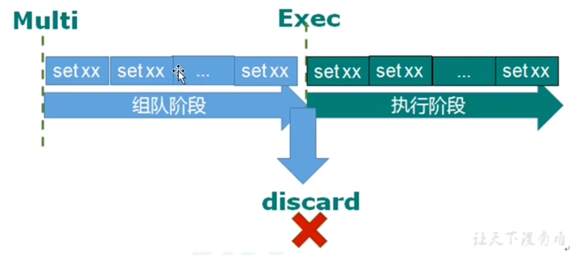

# redis事务和锁机制

<br>

redis事务是一个单独的隔离操作：事务中的所有命令都会序列化、按顺序地执行。事务在执行的过程中，不会被其他客户端发送来的命令请求打断。

redis事务的主要作用就是```串联多个命令```防止别的命令插队。

## 1. multi，exec，discard
从输入multi命令开始，输入的命令都会依次进入命令队列中，但是不会执行，直到输入exec后，redis会将之前的命令队列中的命令依次执行。

组队的过程中可以通过discard来放弃组队。 <br>

<br>

组队阶段如果有命令错误，那么exec执行后所有命令都会失败不会执行。

执行阶段如果有命令执行出错，组队中的其他命令不会失败，会执行成功。


