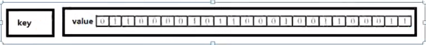

## 1. 字符串（String）
String的数据结构为简单动态字符串（Simple Dynamic String，缩写SDS）。是可以修改的字符串，内部结构实现上类似于java的ArrayList，
采用预分配冗余空间的方式来减少内存的频繁分配。
 <br>
 

<br>

如图中所示，内部为当前字符串实际分配的空间capacity一般要高于实际字符串长度len。当字符串长度小于1M时，扩容时一次只会多扩1M的空间。
需要注意的是字符串最大长度为512M。


<br>
<br>
<br>

## 2. 列表（List）
单键多值

Redis列表是简单的字符串列表，按照插入顺序排序。你可以添加一个元素到列表的头部（左边）或者尾部（右边）。

它的底层实际是个```双向链表```，对两端的操作性能很高，通过索引下标操作中间的节点性能会较差。<br>

<br>

**数据结构：**

List的数据结构为快速链表quickList。

首先在列表元素较少的情况下会使用一块连续的内存存储，这个结构是ziplist，也即是压缩列表。

它将所有的元素紧挨着一起存储，分配的是一块连续的内存。

当数据量比较多的时候才会改成quicklist。

因为普通的链表需要附加指针空间太大，会比较浪费空间。比如这个列表里存的只是int类型的数据，结构上还需要两个额外的指针 prev 和 next。 <br>

<br>

Redis将链表和ziplist结合起来组成了quicklist。也就是将多个ziplis使用双向指针串起来使用。这样既满足了快速的插入删除性能，又不会出现太大的空间冗余。


<br>
<br>
<br>

## 3. 集合（set）
Redis set对外提供的功能与list类似是一个列表的功能，特殊之处在于set是可以自动排重的，当你需要存储一个列表数据，又不希望出现重复数据时，
set是一个很好的选择，并且set提供了判断某个成员是否在一个set集合内的重要接口，这个也是list所不能提供的。

Redis的set是string类型的无序集合。它底层其实是一个value为null的hash表，所以添加，删除，查找的复杂度都是O(1)。

一个算法，随着数据的增加，执行时间的长短，如果是O(1)，数据增加，查找数据的时间不变。


**数据结构：**

set数据结构是dict字典，字典是用哈希表实现的。

java中的HashSet的内部实现使用的是HashMap，只不过所有的value都指向同一个对象。<br>
Redis的set结构也是一样，它的内容也使用hash结构，所有的value都指向同一个内部值。


<br>
<br>
<br>

## 4. 哈希（hash）
redis hash是一个键值对集合。

redis hash 是一个string类型的field和value的映射表，hash特别适合用于存储对象。


**数据结构：**

hash类型对应的数据结构是两种：ziplist（压缩列表），hashtable（哈希表）。当field-value长度较短且个数较少时，使用ziplist，否则使用hashtable。


<br>
<br>
<br>

## 5. 有序集合Zset（sorted set）
redis 有序集合zset与普通集合set非常相似，是一个没有重复元素的字符串集合。

不同之处是有序集合的每个成员都关联了一个评分（score），这个评分（score）被用来按照从低到高的方式排序集合中的成员。集合的成员是唯一的，但是评分是可以重复的。

访问有序集合的中间元素也是非常快的，因此你能够使用有序集合作为一个没有重复成员的智能列表。


**数据结构：**

SortedSet(zset)是redis提供的一个非常特别的数据结构，一方面它等价于java的数据结构Map<String, Double>，可以给每个元素value赋予一个权重score，
另一方面它又类似于TreeSet, 内部的元素按照权重score进行排序，可以得到每个元素的名次，还可以通过score的范围来获取元素的列表。

zset底层使用了两个数据结构

1. hash，hash的作用就是关联value和权重score，保障元素value的唯一性，可以通过元素value找到相应的score值。
2. 跳跃表，跳跃表的目的在于给元素value排序，根据score的范围获取元素列表。


<br>
<br>
<br>

## 6. 位图（Bitmaps）
现代计算机使用二进制（位）作为信息的基础单位，1个字节等于8位，例如abc字符串是由3个字节组成，但实际在计算机存储时将其用二进制表示，
abc分别对应的ASCII码分别是97，98，99，对应的二进制分别是01100001，01100010和01100011，如下图<br>

<br>
合理地使用位操作能够有效地提高内存使用率和开发效率。

redis 提供了Bitmaps这个“数据类型”可以实现对位的操作：
1. Bitmaps本身不是一种数据类型，实际上它就是字符串（key-value），但是它可以对字符串的位进行操作。
2. Bitmaps单独提供了一套命令，所以在redis中使用Bitmaps和使用字符串的方法不太相同。可以把Bitmaps想象成一个以位为单位的数组，数组的每个单元只能存储0和1，数组的下标在Bitmaps中叫做偏移量。
   


<br>
<br>
<br>

## 7. HyperLogLog
Redis HyperLogLog是用来做基数统计的算法，HyperLogLog的优点是，在输入元素的数量或者体积非常非常大时，计算基数所需要的空间总是固定的，并且是很小的。

在redis里面，每个HyperLogLog键只需要花费12kb内存，就可以计算近2^64个不同元素的基数。这和计算基数时，元素越多耗费内存就越多的集合形成了鲜明对比

但是，因为HyperLogLog只会根据输入元素来计算基数，而不会储存输入元素本身，所以HyperLogLog不能像集合那样，返回输入的各个元素。

什么是基数？<br>
比如数据集{1，3，5，7，5，7，8}，那么这个数据集的基数集为{1，3，5，7，8}，基数（不重复元素）为5。基数估计就是在误差可接受的范围内，快速计算基数。


<br>
<br>
<br>

## 8. Geospatial
redis 3.2中增加了对GEO类型的支持。GEO，Geographic,地理信息的缩写。该类型，就是元素的2维坐标，在地图上就是经纬度。redis基于该类型，提供了经纬度设置，查询，范围查询，距离查询，经纬度hash等常见操作。


