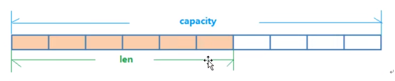

## 字符串（String）
String的数据结构为简单动态字符串（Simple Dynamic String，缩写SDS）。是可以修改的字符串，内部结构实现上类似于java的ArrayList，
采用预分配冗余空间的方式来减少内存的频繁分配。
  
 

 

如图中所示，内部为当前字符串实际分配的空间capacity一般要高于实际字符串长度len。当字符串长度小于1M时，扩容时一次只会多扩1M的空间。
需要注意的是字符串最大长度为512M。