## 1. 配置单位（大小写不敏感）
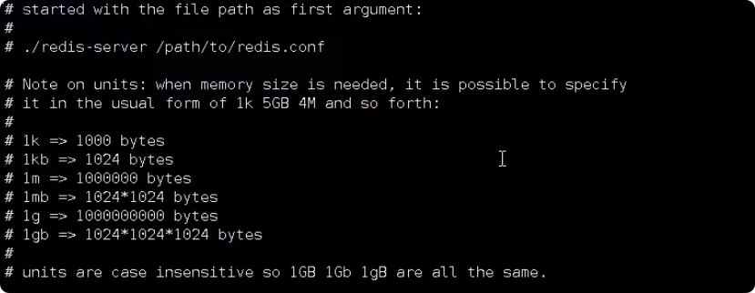

 
 
 

## 2. 引入其他文件的配置
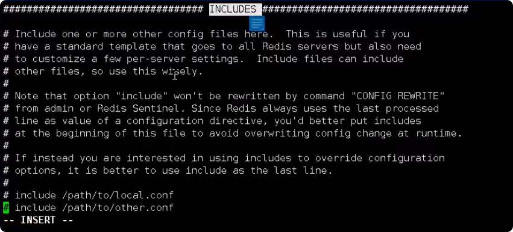

 
 
 

## 3. 网络限制
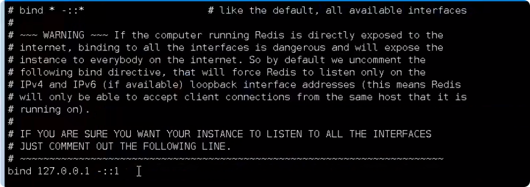

 
 
 

## 4. 保护模式（默认是yes不支持远程访问）
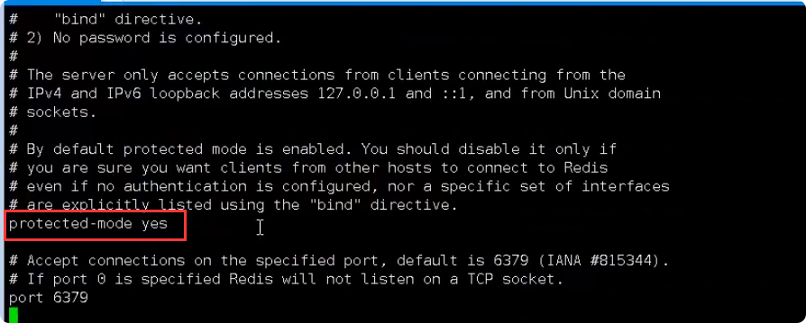

 
 
 

## 5. 端口号
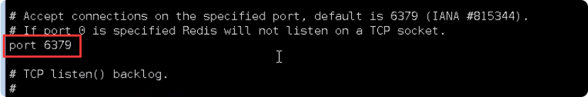

 
 
 

## 6. tcp-backlog
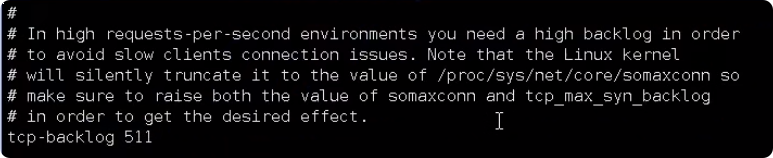

 
 
 

## 7. 超时时间（默认为0永不超时）
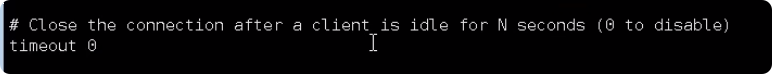

 
 
 

## 8. 连接心跳检测时间
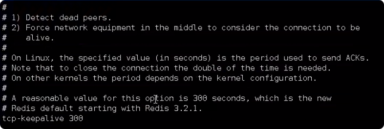

 
 
 

## 9. 运行redis是否作为后台启动
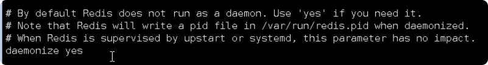

 
 
 

## 10. 日志级别
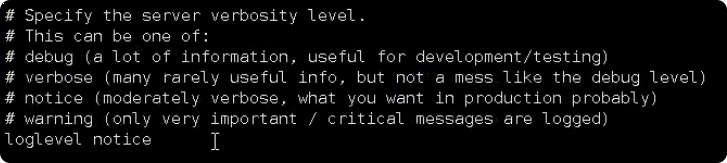

 
 
 

## 11. 日志的输出文件
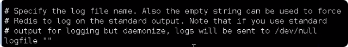

 
 
 

## 12. rdb持久化的配置，文件名
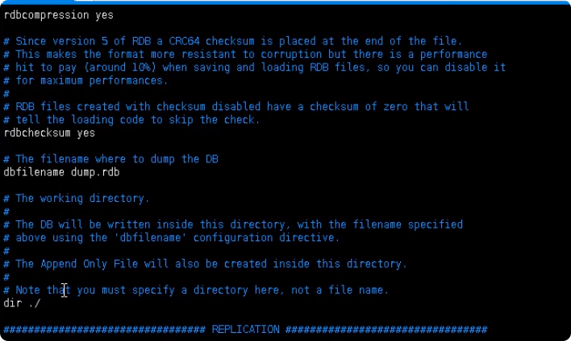  

当redis无法写入硬盘时，直接关掉redis的写操作。推荐yes  
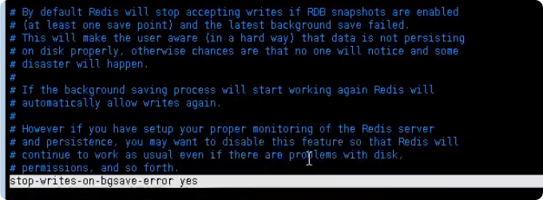

